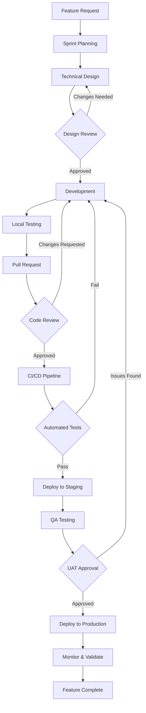
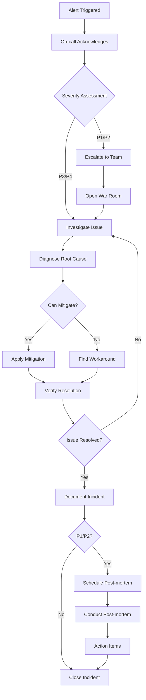
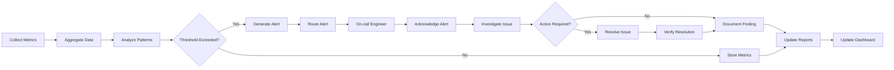
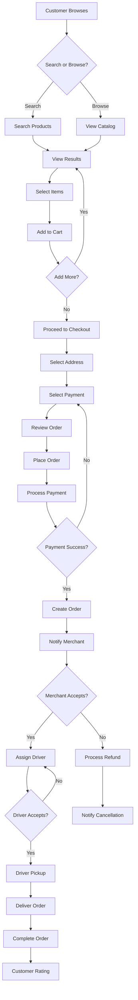
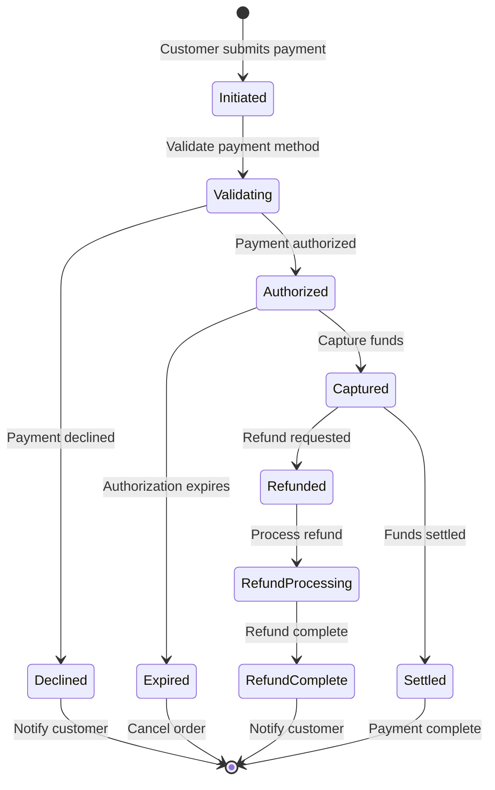

# Process Documentation

## ReskFlow

### Version 1.0.0
### Last Updated: July 2025

---

## Table of Contents

1. [Overview](#overview)
2. [Development Workflows](#development-workflows)
3. [Operational Workflows](#operational-workflows)
4. [Business Process Workflows](#business-process-workflows)
5. [Standard Operating Procedures (SOPs)](#standard-operating-procedures-sops)
6. [Troubleshooting Guide](#troubleshooting-guide)
7. [Runbooks](#runbooks)
8. [Performance Optimization Procedures](#performance-optimization-procedures)
9. [Security Procedures](#security-procedures)
10. [Communication Protocols](#communication-protocols)

---

## Overview

This Process Documentation provides detailed workflows, standard operating procedures, and troubleshooting guides for the ReskFlow platform.

### Document Purpose

- Standardize processes across teams
- Reduce operational errors
- Accelerate problem resolution
- Ensure consistent service reskflow
- Facilitate knowledge transfer

### Process Categories

1. **Development Processes**: Code development, testing, deployment
2. **Operational Processes**: Monitoring, maintenance, incident response
3. **Business Processes**: Customer onboarding, order fulfillment, payments
4. **Support Processes**: Customer service, technical support, escalation

---

## Development Workflows

### Feature Development Workflow



### Git Workflow

```yaml
git_workflow:
  branching_strategy:
    main:
      description: Production-ready code
      protected: true
      deploy_to: production
    
    develop:
      description: Integration branch
      protected: true
      deploy_to: staging
    
    feature/*:
      description: Feature development
      naming: feature/JIRA-123-feature-name
      merge_to: develop
    
    hotfix/*:
      description: Emergency fixes
      naming: hotfix/JIRA-456-fix-description
      merge_to: [main, develop]
    
    release/*:
      description: Release preparation
      naming: release/v1.2.3
      merge_to: [main, develop]

  commit_standards:
    format: |
      <type>(<scope>): <subject>
      
      <body>
      
      <footer>
    
    types: [feat, fix, docs, style, refactor, test, chore]
    
    examples:
      - "feat(auth): add OAuth2 integration"
      - "fix(payment): resolve timeout issue"
      - "docs(api): update endpoint documentation"
```

### Code Review Process

```markdown
## Code Review Checklist

### Functionality
- [ ] Code fulfills the requirements
- [ ] Edge cases are handled
- [ ] Error handling is appropriate
- [ ] No obvious bugs

### Code Quality
- [ ] Code is readable and self-documenting
- [ ] Follows team coding standards
- [ ] No code duplication
- [ ] Appropriate abstractions

### Testing
- [ ] Unit tests cover new code
- [ ] Integration tests where needed
- [ ] Test coverage meets standards (>80%)
- [ ] Tests are meaningful, not just coverage

### Security
- [ ] No hardcoded secrets
- [ ] Input validation implemented
- [ ] SQL injection prevention
- [ ] XSS prevention measures

### Performance
- [ ] No obvious performance issues
- [ ] Database queries are optimized
- [ ] Caching implemented where appropriate
- [ ] No memory leaks

### Documentation
- [ ] Code comments where necessary
- [ ] API documentation updated
- [ ] README updated if needed
- [ ] Changelog entry added
```

### Release Process

```yaml
release_process:
  preparation:
    - Create release branch from develop
    - Update version numbers
    - Update changelog
    - Run full test suite
    - Build release artifacts
  
  testing:
    - Deploy to staging
    - Run regression tests
    - Perform security scan
    - Load testing if needed
    - UAT sign-off
  
  deployment:
    - Create release tag
    - Deploy to production (canary)
    - Monitor metrics
    - Progressive rollout
    - Full deployment
  
  post_release:
    - Merge to main
    - Merge back to develop
    - Create GitHub release
    - Update documentation
    - Notify stakeholders
  
  rollback_plan:
    trigger:
      - Error rate > 5%
      - Performance degradation > 50%
      - Critical bug discovered
    
    steps:
      - Revert deployment
      - Restore previous version
      - Clear caches
      - Verify functionality
      - Incident report
```

---

## Operational Workflows

### Incident Response Workflow



### Deployment Workflow

```yaml
deployment_workflow:
  pre_deployment:
    - Verify release notes
    - Check deployment window
    - Notify stakeholders
    - Backup current state
    - Prepare rollback plan
  
  deployment_steps:
    1_health_check:
      command: ./scripts/health-check.sh all
      expected: All services healthy
    
    2_enable_maintenance:
      command: ./scripts/maintenance-mode.sh enable
      duration: 5 minutes
    
    3_database_migration:
      command: npm run migrate:production
      rollback: npm run migrate:rollback
    
    4_deploy_services:
      strategy: blue-green
      steps:
        - Deploy to blue environment
        - Run smoke tests
        - Switch traffic to blue
        - Monitor for 10 minutes
        - Decommission green
    
    5_verify_deployment:
      checks:
        - API health endpoints
        - Key user journeys
        - Performance metrics
        - Error rates
    
    6_disable_maintenance:
      command: ./scripts/maintenance-mode.sh disable
  
  post_deployment:
    - Update status page
    - Send completion notice
    - Monitor for 30 minutes
    - Update documentation
    - Close deployment ticket
```

### Monitoring Workflow



---

## Business Process Workflows

### Customer Order Workflow



### Merchant Onboarding Workflow

```yaml
merchant_onboarding:
  stages:
    1_application:
      steps:
        - Submit business information
        - Upload required documents
        - Accept terms and conditions
      
      documents_required:
        - Business license
        - Tax ID
        - Bank account details
        - Insurance certificate
        - Food permit (if applicable)
      
      validation:
        - Business name uniqueness
        - Document authenticity
        - Address verification
    
    2_verification:
      steps:
        - Background check
        - Document verification
        - Bank account validation
        - Site inspection (if required)
      
      timeline: 2-3 business days
      
      criteria:
        - Valid business license
        - Clean background check
        - Verified bank account
        - Meets quality standards
    
    3_setup:
      steps:
        - Create merchant account
        - Configure payment settings
        - Set up menu/catalog
        - Configure reskflow zones
        - Set operating hours
      
      training:
        - Platform walkthrough
        - Order management
        - Best practices
        - Support channels
    
    4_activation:
      steps:
        - Final review
        - Test order
        - Go live
        - Monitor first week
      
      support:
        - Dedicated onboarding specialist
        - Daily check-ins first week
        - Performance review after 30 days
```

### Payment Processing Workflow



---

## Standard Operating Procedures (SOPs)

### SOP-001: Daily Health Check

```yaml
sop_daily_health_check:
  metadata:
    id: SOP-001
    title: Daily System Health Check
    owner: Operations Team
    frequency: Daily at 08:00 UTC
    duration: 30 minutes
  
  procedure:
    1_system_status:
      description: Check overall system health
      steps:
        - Open monitoring dashboard
        - Verify all services are green
        - Check error rates < 0.1%
        - Verify response times < SLA
      
      tools:
        - Datadog dashboard
        - Custom health check script
      
      expected_output: All systems operational
    
    2_database_health:
      description: Verify database performance
      steps:
        - Check connection pool usage
        - Verify replication lag < 1s
        - Review slow query log
        - Check disk space > 20%
      
      commands:
        - psql -c "SELECT * FROM pg_stat_replication;"
        - psql -c "SELECT * FROM pg_stat_activity;"
    
    3_infrastructure_check:
      description: Review infrastructure metrics
      steps:
        - CPU utilization < 70%
        - Memory usage < 80%
        - Disk I/O normal
        - Network latency < 50ms
    
    4_backup_verification:
      description: Confirm backup completion
      steps:
        - Check last backup timestamp
        - Verify backup size reasonable
        - Test restore on random file
        - Update backup log
    
    5_security_review:
      description: Review security alerts
      steps:
        - Check failed login attempts
        - Review firewall blocks
        - Verify certificate expiry > 30 days
        - Check for security patches
  
  escalation:
    condition: Any check fails
    action: Create incident ticket
    notify: on-call engineer
```

### SOP-002: Customer Data Request (GDPR)

```yaml
sop_gdpr_request:
  metadata:
    id: SOP-002
    title: Handle GDPR Data Request
    owner: Privacy Team
    sla: 30 days
    priority: High
  
  procedure:
    1_receive_request:
      channels:
        - Email: shahin@resket.ca
        - Portal: Account settings
        - Support: Ticket system
      
      validation:
        - Verify user identity
        - Confirm request type
        - Check request validity
        - Create tracking ticket
    
    2_process_request:
      types:
        access:
          description: Provide copy of user data
          steps:
            - Run data export script
            - Include all personal data
            - Format as JSON/CSV
            - Encrypt file
          
          script: ./scripts/export-user-data.sh <user_id>
        
        deletion:
          description: Delete user data
          steps:
            - Verify no active orders
            - Anonymize historical data
            - Delete personal information
            - Retain legal requirements
          
          script: ./scripts/delete-user-data.sh <user_id>
        
        portability:
          description: Provide portable format
          steps:
            - Export in standard format
            - Include all relations
            - Provide schema documentation
            - Compress and encrypt
    
    3_quality_check:
      steps:
        - Review exported data
        - Verify completeness
        - Check for sensitive data
        - Manager approval
    
    4_deliver_response:
      steps:
        - Send secure download link
        - Provide access for 7 days
        - Include instruction letter
        - Update ticket status
    
    5_documentation:
      requirements:
        - Log request details
        - Document actions taken
        - Store for compliance
        - Update metrics
```

### SOP-003: Service Deployment

```yaml
sop_service_deployment:
  metadata:
    id: SOP-003
    title: Production Service Deployment
    owner: DevOps Team
    approval_required: true
    change_window: Tuesday/Thursday 02:00-04:00 UTC
  
  pre_deployment:
    T-24h:
      - Review deployment plan
      - Verify approvals
      - Check blackout dates
      - Send notification
    
    T-1h:
      - Verify team availability
      - Check system health
      - Review rollback plan
      - Prepare commands
  
  deployment:
    1_preparation:
      duration: 15 minutes
      steps:
        - Enable deployment mode
        - Increase monitoring
        - Notify on-call
        - Start recording
      
      commands:
        - kubectl config use-context production
        - ./scripts/enable-deployment-mode.sh
    
    2_backup:
      duration: 10 minutes
      steps:
        - Backup current configs
        - Snapshot databases
        - Save current images
      
      commands:
        - ./scripts/backup-pre-deployment.sh
        - kubectl get deployments -o yaml > backup.yaml
    
    3_deploy:
      duration: 20 minutes
      steps:
        - Apply new configs
        - Roll out services
        - Monitor progress
        - Verify health
      
      strategy: |
        kubectl apply -f k8s/
        kubectl rollout status deployment/api-gateway
        kubectl rollout status deployment/user-service
    
    4_validation:
      duration: 15 minutes
      tests:
        - Health check endpoints
        - Smoke test suite
        - Key user journeys
        - Performance baseline
      
      acceptance_criteria:
        - All health checks pass
        - Error rate < 0.1%
        - Response time < 110% baseline
        - No critical alerts
  
  post_deployment:
    immediate:
      - Disable deployment mode
      - Update status page
      - Send success notification
      - Monitor for 30 minutes
    
    follow_up:
      - Update documentation
      - Close change ticket
      - Schedule retrospective
      - Share lessons learned
```

---

## Troubleshooting Guide

### Common Issues and Solutions

#### High Response Times

```yaml
issue: High API Response Times
symptoms:
  - P95 latency > 2 seconds
  - Customer complaints about slowness
  - Timeout errors increasing

diagnostic_steps:
  1_identify_scope:
    - Check if all endpoints affected
    - Identify specific slow endpoints
    - Determine when issue started
    
    commands:
      - curl -w "@curl-format.txt" -s https://api/health
      - kubectl top pods
      - kubectl logs -f deployment/api-gateway --tail=100
  
  2_check_resources:
    - CPU and memory usage
    - Database connection pool
    - Network latency
    
    queries: |
      SELECT count(*) FROM pg_stat_activity;
      SELECT * FROM pg_stat_database;
  
  3_analyze_queries:
    - Check slow query log
    - Look for missing indexes
    - Identify lock contention
    
    queries: |
      SELECT query, mean_exec_time 
      FROM pg_stat_statements 
      ORDER BY mean_exec_time DESC 
      LIMIT 10;

solutions:
  immediate:
    - Scale up services
    - Clear application cache
    - Restart connection pools
    - Enable emergency cache
  
  commands:
    - kubectl scale deployment api-gateway --replicas=10
    - redis-cli FLUSHDB
    - kubectl rollout restart deployment/api-gateway
  
  long_term:
    - Optimize slow queries
    - Add database indexes
    - Implement caching layer
    - Review architecture
```

#### Payment Failures

```yaml
issue: Increased Payment Failures
symptoms:
  - Payment success rate < 95%
  - Customer reports of declined payments
  - Timeout errors from payment gateway

diagnostic_steps:
  1_check_gateway_status:
    - Verify payment provider status
    - Check API rate limits
    - Review error responses
    
    endpoints:
      - https://status.stripe.com
      - https://api.stripe.com/v1/health
  
  2_analyze_failures:
    - Group by error type
    - Check for patterns
    - Identify affected cards
    
    queries: |
      SELECT 
        error_code,
        COUNT(*) as count,
        AVG(amount) as avg_amount
      FROM payment_attempts
      WHERE created_at > NOW() - INTERVAL '1 hour'
        AND status = 'failed'
      GROUP BY error_code
      ORDER BY count DESC;
  
  3_verify_integration:
    - Check API credentials
    - Verify webhook endpoints
    - Test with test cards

solutions:
  immediate:
    - Switch to backup payment provider
    - Enable payment queue
    - Increase timeout values
    - Clear provider cache
  
  scripts:
    - ./scripts/switch-payment-provider.sh backup
    - ./scripts/enable-payment-queue.sh
    - ./scripts/update-timeout.sh payment 10000
  
  investigation:
    - Contact payment provider
    - Review recent changes
    - Check for fraud rules
    - Analyze transaction patterns
```

#### Database Connection Issues

```yaml
issue: Database Connection Pool Exhausted
symptoms:
  - "too many connections" errors
  - Application timeouts
  - Intermittent failures

diagnostic_steps:
  1_check_connections:
    queries: |
      -- Current connections
      SELECT count(*) FROM pg_stat_activity;
      
      -- By application
      SELECT 
        application_name,
        count(*) 
      FROM pg_stat_activity 
      GROUP BY application_name;
      
      -- Long running queries
      SELECT 
        pid,
        now() - query_start as duration,
        query 
      FROM pg_stat_activity 
      WHERE state != 'idle' 
      ORDER BY duration DESC;
  
  2_identify_leaks:
    - Check for stuck transactions
    - Look for idle connections
    - Review application logs
  
  3_analyze_pool_config:
    - Verify pool size settings
    - Check timeout configurations
    - Review connection lifecycle

solutions:
  immediate:
    - Kill idle connections
    - Restart application pools
    - Increase connection limit
    
    commands: |
      # Kill connections older than 1 hour
      SELECT pg_terminate_backend(pid) 
      FROM pg_stat_activity 
      WHERE state = 'idle' 
        AND state_change < now() - interval '1 hour';
      
      # Restart services
      kubectl rollout restart deployment/api-gateway
      
      # Temporary increase
      ALTER SYSTEM SET max_connections = 500;
      SELECT pg_reload_conf();
  
  permanent:
    - Implement connection pooling
    - Add pgBouncer
    - Optimize query patterns
    - Use read replicas
```

### Performance Issues

#### Memory Leaks

```javascript
// Memory Leak Detection Script
// /opt/ReskFlow/scripts/detect-memory-leak.js

const v8 = require('v8');
const fs = require('fs');

class MemoryMonitor {
  constructor() {
    this.baseline = process.memoryUsage();
    this.snapshots = [];
    this.threshold = 100 * 1024 * 1024; // 100MB
  }

  captureSnapshot() {
    const usage = process.memoryUsage();
    const heap = v8.getHeapStatistics();
    
    const snapshot = {
      timestamp: new Date(),
      rss: usage.rss,
      heapTotal: usage.heapTotal,
      heapUsed: usage.heapUsed,
      external: usage.external,
      heapSizeLimit: heap.heap_size_limit,
      totalAvailable: heap.total_available_size
    };
    
    this.snapshots.push(snapshot);
    
    // Check for potential leak
    if (this.snapshots.length > 10) {
      const growth = snapshot.heapUsed - this.snapshots[0].heapUsed;
      if (growth > this.threshold) {
        this.reportLeak(growth);
      }
    }
    
    return snapshot;
  }
  
  reportLeak(growth) {
    console.error(`Potential memory leak detected: ${Math.round(growth / 1024 / 1024)}MB growth`);
    
    // Take heap snapshot
    const heapSnapshot = v8.writeHeapSnapshot();
    console.log(`Heap snapshot written to: ${heapSnapshot}`);
    
    // Alert
    this.sendAlert({
      severity: 'warning',
      service: process.env.SERVICE_NAME,
      message: 'Potential memory leak detected',
      growth: growth,
      snapshot: heapSnapshot
    });
  }
  
  analyze() {
    if (this.snapshots.length < 2) return null;
    
    const first = this.snapshots[0];
    const last = this.snapshots[this.snapshots.length - 1];
    const duration = last.timestamp - first.timestamp;
    
    return {
      duration: duration,
      heapGrowth: last.heapUsed - first.heapUsed,
      growthRate: (last.heapUsed - first.heapUsed) / duration * 1000 * 60, // per minute
      currentUsage: last.heapUsed / last.heapSizeLimit * 100
    };
  }
}

// Usage
const monitor = new MemoryMonitor();
setInterval(() => {
  monitor.captureSnapshot();
  const analysis = monitor.analyze();
  if (analysis) {
    console.log('Memory Analysis:', analysis);
  }
}, 60000); // Every minute
```

#### Slow Queries

```sql
-- Query Optimization Troubleshooting
-- Find slow queries

-- 1. Enable query logging
ALTER SYSTEM SET log_min_duration_statement = 1000; -- Log queries > 1s
SELECT pg_reload_conf();

-- 2. Analyze slow queries
SELECT 
    query,
    calls,
    total_exec_time,
    mean_exec_time,
    stddev_exec_time,
    rows
FROM pg_stat_statements
WHERE mean_exec_time > 1000 -- Queries averaging > 1s
ORDER BY mean_exec_time DESC
LIMIT 20;

-- 3. Check for missing indexes
SELECT 
    schemaname,
    tablename,
    attname,
    n_distinct,
    most_common_vals
FROM pg_stats
WHERE schemaname = 'public'
    AND n_distinct > 100
    AND tablename IN (
        SELECT tablename 
        FROM pg_stat_user_tables 
        WHERE seq_scan > idx_scan
    );

-- 4. Identify blocking queries
SELECT 
    blocked_locks.pid AS blocked_pid,
    blocked_activity.usename AS blocked_user,
    blocking_locks.pid AS blocking_pid,
    blocking_activity.usename AS blocking_user,
    blocked_activity.query AS blocked_statement,
    blocking_activity.query AS blocking_statement
FROM pg_catalog.pg_locks blocked_locks
JOIN pg_catalog.pg_stat_activity blocked_activity ON blocked_activity.pid = blocked_locks.pid
JOIN pg_catalog.pg_locks blocking_locks 
    ON blocking_locks.locktype = blocked_locks.locktype
    AND blocking_locks.database IS NOT DISTINCT FROM blocked_locks.database
    AND blocking_locks.relation IS NOT DISTINCT FROM blocked_locks.relation
    AND blocking_locks.page IS NOT DISTINCT FROM blocked_locks.page
    AND blocking_locks.tuple IS NOT DISTINCT FROM blocked_locks.tuple
    AND blocking_locks.virtualxid IS NOT DISTINCT FROM blocked_locks.virtualxid
    AND blocking_locks.transactionid IS NOT DISTINCT FROM blocked_locks.transactionid
    AND blocking_locks.classid IS NOT DISTINCT FROM blocked_locks.classid
    AND blocking_locks.objid IS NOT DISTINCT FROM blocked_locks.objid
    AND blocking_locks.objsubid IS NOT DISTINCT FROM blocked_locks.objsubid
    AND blocking_locks.pid != blocked_locks.pid
JOIN pg_catalog.pg_stat_activity blocking_activity ON blocking_activity.pid = blocking_locks.pid
WHERE NOT blocked_locks.granted;

-- 5. Fix common issues
-- Add missing index
CREATE INDEX CONCURRENTLY idx_orders_user_created 
ON orders(user_id, created_at DESC)
WHERE status != 'cancelled';

-- Update statistics
ANALYZE orders;

-- Rewrite problematic query
-- Before:
SELECT * FROM orders o
JOIN users u ON o.user_id = u.id
WHERE o.created_at > NOW() - INTERVAL '30 days'
    AND u.status = 'active';

-- After:
WITH recent_orders AS (
    SELECT * FROM orders
    WHERE created_at > NOW() - INTERVAL '30 days'
)
SELECT ro.*, u.*
FROM recent_orders ro
JOIN users u ON ro.user_id = u.id
WHERE u.status = 'active';
```

---

## Runbooks

### RUN-001: Service Restart Procedure

```yaml
runbook:
  id: RUN-001
  title: Service Restart Procedure
  description: Steps to safely restart a service in production
  severity: Medium
  estimated_time: 15 minutes
  
  prerequisites:
    - Service name identified
    - Impact assessment completed
    - Notification sent if customer-facing
    - Rollback plan ready
  
  procedure:
    1_verify_current_state:
      description: Check service health before restart
      commands:
        - kubectl get pods -l app=<service-name>
        - kubectl logs deployment/<service-name> --tail=50
        - curl http://<service-name>:3000/health
      
      expected: Service is running but needs restart
    
    2_create_backup:
      description: Backup current configuration
      commands:
        - kubectl get deployment <service-name> -o yaml > backup-<service-name>.yaml
        - kubectl get configmap <service-name>-config -o yaml > backup-config.yaml
    
    3_graceful_shutdown:
      description: Initiate graceful shutdown
      commands:
        - kubectl scale deployment <service-name> --replicas=0
        - sleep 30  # Allow time for connections to drain
      
      verification:
        - kubectl get pods -l app=<service-name>  # Should show 0 pods
    
    4_clear_state:
      description: Clear any cached state if needed
      optional: true
      commands:
        - redis-cli DEL <service-name>:*
        - rm -rf /tmp/<service-name>/*
    
    5_restart_service:
      description: Start service with original replica count
      commands:
        - kubectl scale deployment <service-name> --replicas=3
        - kubectl rollout status deployment/<service-name>
      
      wait_for: All pods running and ready
    
    6_verify_health:
      description: Confirm service is healthy
      commands:
        - kubectl get pods -l app=<service-name>
        - for i in {1..10}; do curl http://<service-name>:3000/health && break || sleep 5; done
        - kubectl logs deployment/<service-name> --tail=20
      
      success_criteria:
        - All pods running
        - Health endpoint returns 200
        - No error logs
    
    7_smoke_test:
      description: Run basic functionality test
      commands:
        - ./scripts/smoke-test.sh <service-name>
      
      expected: All tests pass
  
  rollback:
    description: If restart fails, restore from backup
    commands:
      - kubectl apply -f backup-<service-name>.yaml
      - kubectl apply -f backup-config.yaml
      - kubectl rollout restart deployment/<service-name>
  
  post_actions:
    - Update service status
    - Notify stakeholders
    - Document any issues
    - Remove backup files
```

### RUN-002: Database Failover

```yaml
runbook:
  id: RUN-002
  title: PostgreSQL Failover Procedure
  description: Failover from primary to standby PostgreSQL
  severity: Critical
  estimated_time: 30 minutes
  approval_required: true
  
  triggers:
    - Primary database unresponsive
    - Replication lag > 5 minutes
    - Data corruption detected
    - Planned maintenance
  
  procedure:
    1_assess_situation:
      description: Determine failover necessity
      checks:
        - Try connecting to primary
        - Check replication status
        - Verify standby health
        - Review recent errors
      
      commands:
        - psql -h primary-db -c "SELECT 1;"
        - psql -h standby-db -c "SELECT pg_is_in_recovery();"
        - psql -h standby-db -c "SELECT now() - pg_last_xact_replay_timestamp() AS lag;"
      
      decision_criteria:
        - Primary truly down
        - Standby lag < 1 minute
        - No split-brain risk
    
    2_stop_applications:
      description: Prevent writes to database
      commands:
        - kubectl scale deployment api-gateway --replicas=0
        - kubectl scale deployment order-service --replicas=0
        - ./scripts/enable-maintenance-mode.sh
      
      verification: No active connections to primary
    
    3_promote_standby:
      description: Promote standby to primary
      commands:
        - ssh standby-db
        - sudo -u postgres pg_ctl promote -D /var/lib/postgresql/data
        - psql -c "SELECT pg_is_in_recovery();"  # Should return false
      
      wait_for: Promotion complete
    
    4_update_configuration:
      description: Point applications to new primary
      steps:
        - Update connection strings
        - Update DNS if used
        - Update monitoring
      
      commands:
        - kubectl set env deployment/api-gateway DATABASE_URL=postgresql://user@standby-db/reskflow
        - kubectl set env deployment/order-service DATABASE_URL=postgresql://user@standby-db/reskflow
        - ./scripts/update-dns.sh db.ReskFlow.com standby-db
    
    5_restart_applications:
      description: Resume normal operations
      commands:
        - kubectl scale deployment api-gateway --replicas=5
        - kubectl scale deployment order-service --replicas=3
        - ./scripts/disable-maintenance-mode.sh
      
      verification:
        - Applications connecting successfully
        - No connection errors
        - Transactions processing
    
    6_verify_operations:
      description: Confirm system functionality
      tests:
        - Health check all services
        - Place test order
        - Verify data consistency
        - Check performance metrics
      
      commands:
        - ./scripts/health-check.sh all
        - ./scripts/test-order.sh
        - ./scripts/verify-data-integrity.sh
    
    7_setup_new_standby:
      description: Configure old primary as new standby
      timeline: Within 4 hours
      steps:
        - Rebuild old primary from backup
        - Configure as standby
        - Start replication
        - Verify sync status
  
  communication:
    internal:
      - Notify development team
      - Update operations channel
      - Email executive summary
    
    external:
      - Update status page
      - Notify major customers if affected
      - Prepare RCA document
```

---

## Performance Optimization Procedures

### Database Optimization

```yaml
performance_optimization:
  database_tuning:
    weekly_maintenance:
      vacuum_analyze:
        description: Update statistics and reclaim space
        commands:
          - vacuumdb --all --analyze --verbose
          - psql -c "SELECT schemaname, tablename, last_vacuum, last_analyze FROM pg_stat_user_tables;"
        
        schedule: Sunday 02:00 UTC
      
      index_maintenance:
        description: Rebuild bloated indexes
        script: |
          #!/bin/bash
          # Find bloated indexes
          psql -c "
          SELECT
              schemaname,
              tablename,
              indexname,
              pg_size_pretty(pg_relation_size(indexrelid)) AS index_size,
              idx_scan as index_scans
          FROM pg_stat_user_indexes
          WHERE pg_relation_size(indexrelid) > 100000000 -- 100MB
              AND idx_scan < 100
          ORDER BY pg_relation_size(indexrelid) DESC;"
          
          # Rebuild if needed
          psql -c "REINDEX INDEX CONCURRENTLY large_index_name;"
    
    query_optimization:
      identify_slow_queries:
        tool: pg_stat_statements
        threshold: 1000ms
        
        analysis: |
          SELECT 
              queryid,
              query,
              calls,
              total_exec_time,
              mean_exec_time,
              stddev_exec_time
          FROM pg_stat_statements
          WHERE mean_exec_time > 1000
          ORDER BY mean_exec_time DESC
          LIMIT 20;
      
      optimization_techniques:
        - Add appropriate indexes
        - Rewrite queries to use indexes
        - Partition large tables
        - Use materialized views
        - Implement query result caching
```

### Application Performance

```javascript
// Performance Optimization Monitoring
// /opt/ReskFlow/scripts/performance-monitor.js

const cluster = require('cluster');
const os = require('os');

class PerformanceOptimizer {
  constructor() {
    this.metrics = {
      requestCount: 0,
      totalResponseTime: 0,
      errorCount: 0,
      slowRequests: []
    };
    
    this.thresholds = {
      responseTime: 1000, // 1 second
      errorRate: 0.01,    // 1%
      cpuUsage: 0.8,      // 80%
      memoryUsage: 0.85   // 85%
    };
  }
  
  optimizeWorkerCount() {
    const cpus = os.cpus().length;
    const currentWorkers = Object.keys(cluster.workers).length;
    
    // Dynamic worker scaling based on load
    const loadAverage = os.loadavg()[0];
    const optimalWorkers = Math.min(
      Math.max(2, Math.floor(loadAverage * 1.5)),
      cpus
    );
    
    if (optimalWorkers > currentWorkers) {
      console.log(`Scaling up workers from ${currentWorkers} to ${optimalWorkers}`);
      for (let i = currentWorkers; i < optimalWorkers; i++) {
        cluster.fork();
      }
    } else if (optimalWorkers < currentWorkers - 1) {
      console.log(`Scaling down workers from ${currentWorkers} to ${optimalWorkers}`);
      const workers = Object.values(cluster.workers);
      for (let i = 0; i < currentWorkers - optimalWorkers; i++) {
        workers[i].disconnect();
      }
    }
  }
  
  enableEmergencyMode() {
    console.log('Enabling emergency performance mode');
    
    // Disable non-critical features
    process.env.FEATURES_DISABLED = JSON.stringify([
      'recommendations',
      'analytics_realtime',
      'image_processing',
      'email_notifications'
    ]);
    
    // Reduce cache TTL
    process.env.CACHE_TTL = '300'; // 5 minutes
    
    // Enable aggressive caching
    process.env.AGGRESSIVE_CACHE = 'true';
    
    // Reduce database pool
    process.env.DB_POOL_MAX = '10';
    
    // Notify all workers
    for (const id in cluster.workers) {
      cluster.workers[id].send({ cmd: 'emergency_mode' });
    }
  }
  
  analyzePerformance() {
    const avgResponseTime = this.metrics.totalResponseTime / this.metrics.requestCount;
    const errorRate = this.metrics.errorCount / this.metrics.requestCount;
    const cpuUsage = os.loadavg()[0] / os.cpus().length;
    const memoryUsage = 1 - (os.freemem() / os.totalmem());
    
    const analysis = {
      avgResponseTime,
      errorRate,
      cpuUsage,
      memoryUsage,
      status: 'normal'
    };
    
    if (avgResponseTime > this.thresholds.responseTime ||
        errorRate > this.thresholds.errorRate ||
        cpuUsage > this.thresholds.cpuUsage ||
        memoryUsage > this.thresholds.memoryUsage) {
      analysis.status = 'degraded';
      this.enableEmergencyMode();
    }
    
    return analysis;
  }
}
```

---

## Security Procedures

### Security Incident Response

```yaml
security_incident_response:
  classification:
    P1_critical:
      - Data breach confirmed
      - Active system compromise
      - Ransomware detected
      - Customer data exposed
    
    P2_high:
      - Suspicious activity detected
      - Failed intrusion attempt
      - Vulnerability exploited
      - Insider threat suspected
    
    P3_medium:
      - Policy violation
      - Unusual access patterns
      - Security scan findings
  
  response_procedure:
    1_detection:
      sources:
        - Security monitoring alerts
        - User reports
        - Automated scans
        - Third-party notification
      
      initial_actions:
        - Verify the incident
        - Assess severity
        - Start incident timer
        - Initiate security response
    
    2_containment:
      immediate:
        - Isolate affected systems
        - Disable compromised accounts
        - Block malicious IPs
        - Preserve evidence
      
      commands:
        - ./scripts/isolate-system.sh <system-name>
        - ./scripts/disable-account.sh <username>
        - ./scripts/block-ip.sh <ip-address>
        - ./scripts/capture-evidence.sh <incident-id>
    
    3_investigation:
      steps:
        - Analyze logs
        - Review access patterns
        - Check file integrity
        - Interview involved parties
      
      tools:
        - SIEM dashboard
        - Log analysis scripts
        - Forensic toolkit
        - Network packet capture
    
    4_eradication:
      actions:
        - Remove malicious code
        - Patch vulnerabilities
        - Reset credentials
        - Update security rules
      
      verification:
        - Run security scans
        - Check system integrity
        - Verify clean state
        - Test functionality
    
    5_recovery:
      steps:
        - Restore from clean backup
        - Rebuild affected systems
        - Re-enable services
        - Monitor closely
      
      validation:
        - All services operational
        - No suspicious activity
        - Performance normal
        - Security controls active
    
    6_post_incident:
      documentation:
        - Timeline of events
        - Actions taken
        - Lessons learned
        - Improvement recommendations
      
      follow_up:
        - Update security policies
        - Implement new controls
        - Conduct training
        - Schedule security review
```

### Vulnerability Management

```yaml
vulnerability_management:
  scanning:
    infrastructure:
      frequency: weekly
      tools:
        - Nessus
        - OpenVAS
        - AWS Inspector
      
      scope:
        - All production servers
        - Network devices
        - Cloud resources
    
    application:
      frequency: per deployment
      tools:
        - OWASP ZAP
        - Burp Suite
        - SonarQube
      
      checks:
        - OWASP Top 10
        - Business logic flaws
        - Authentication bypass
        - API security
    
    dependencies:
      frequency: daily
      tools:
        - npm audit
        - Snyk
        - GitHub Dependabot
      
      actions:
        - Auto-update patches
        - Create PRs for updates
        - Block critical vulnerabilities
  
  remediation:
    prioritization:
      critical:
        timeline: 24 hours
        approval: Security team
        
      high:
        timeline: 7 days
        approval: Tech lead
        
      medium:
        timeline: 30 days
        approval: Standard process
        
      low:
        timeline: 90 days
        approval: Backlog
    
    process:
      1_assess:
        - Verify vulnerability
        - Determine impact
        - Check exploitability
        - Identify affected systems
      
      2_plan:
        - Develop fix
        - Test solution
        - Plan deployment
        - Prepare rollback
      
      3_implement:
        - Deploy fix
        - Verify resolution
        - Update documentation
        - Close ticket
```

---

## Communication Protocols

### Incident Communication

```yaml
incident_communication:
  internal:
    channels:
      immediate:
        - Slack: #incidents
        - PagerDuty escalation
        - Phone tree for P1
      
      updates:
        - Status page
        - Email updates
        - Slack announcements
    
    templates:
      initial_notification: |
        🚨 INCIDENT DETECTED
        Severity: {severity}
        Service: {service}
        Impact: {impact}
        Time: {timestamp}
        IC: {incident_commander}
        
        Join: {conference_link}
      
      status_update: |
        📊 INCIDENT UPDATE
        Status: {status}
        Progress: {progress}
        ETA: {eta}
        Actions: {current_actions}
        
        Next update in 30 minutes
      
      resolution: |
        ✅ INCIDENT RESOLVED
        Duration: {duration}
        Root cause: {summary}
        Customer impact: {impact}
        
        Post-mortem scheduled: {date}
  
  external:
    customers:
      triggers:
        - Service degradation > 10%
        - Outage > 5 minutes
        - Data incident
        - Security issue
      
      channels:
        - Status page
        - Email to affected users
        - In-app banner
        - Social media
      
      messaging:
        acknowledge: |
          We're aware of an issue affecting {service}.
          Investigation is underway.
          Updates: {status_page_url}
        
        update: |
          Update on {service} issue:
          {progress}
          Estimated resolution: {eta}
        
        resolved: |
          The issue with {service} has been resolved.
          We apologize for any inconvenience.
          Details: {postmortem_url}
    
    stakeholders:
      criteria:
        - Revenue impact > $10,000
        - Customer impact > 1,000
        - Media attention likely
        - Regulatory implications
      
      contacts:
        - Executive team
        - Legal counsel
        - PR team
        - Major customers
```

### Change Communication

```yaml
change_communication:
  planned_maintenance:
    timeline:
      T-7_days:
        - Post to status page
        - Email major customers
        - Update in-app banner
      
      T-24_hours:
        - Send reminder email
        - Post on social media
        - Brief support team
      
      T-1_hour:
        - Final reminder
        - Update status page
        - Prepare war room
    
    templates:
      advance_notice: |
        Subject: Scheduled Maintenance - {date}
        
        We'll be performing maintenance on {date} from {start} to {end} {timezone}.
        
        Expected impact:
        - {impact_description}
        
        What you need to do:
        - {customer_actions}
        
        Questions? Contact shahin@resket.ca
  
  feature_releases:
    channels:
      - Blog post
      - Email announcement
      - In-app notification
      - API changelog
    
    content:
      - What's new
      - Benefits
      - How to use
      - Migration guide
      - Breaking changes
```

---

## Appendices

### Appendix A: Command Reference

```bash
# Common Operational Commands

# Health Checks
./scripts/health-check.sh all                    # Check all services
curl -s http://localhost:3000/health | jq .      # Check specific service

# Deployments
kubectl rollout status deployment/api-gateway    # Check deployment status
kubectl rollout undo deployment/api-gateway      # Rollback deployment

# Troubleshooting
kubectl logs -f deployment/api-gateway --tail=100        # View logs
kubectl exec -it api-gateway-pod -- /bin/sh              # Shell into pod
kubectl describe pod api-gateway-pod                     # Pod details

# Database
psql -h localhost -U postgres -d reskflow -c "SELECT 1;" # Test connection
pg_dump -h localhost -U postgres reskflow > backup.sql   # Backup database

# Cache
redis-cli ping                                   # Test Redis connection
redis-cli --scan --pattern "user:*" | wc -l      # Count keys by pattern

# Monitoring
curl -s http://localhost:9090/metrics            # Prometheus metrics
```

### Appendix B: Contact Information

| Role | Name | Email | Phone | Escalation |
|------|------|-------|-------|------------|
| On-call Primary | Rotation | oncall@company.com | +1-xxx-xxxx | PagerDuty |
| On-call Secondary | Rotation | oncall-backup@company.com | +1-xxx-xxxx | PagerDuty |
| Engineering Manager | John Doe | john.doe@company.com | +1-xxx-xxxx | Slack |
| Director of Engineering | Jane Smith | jane.smith@company.com | +1-xxx-xxxx | Phone |
| CTO | Bob Johnson | bob.johnson@company.com | +1-xxx-xxxx | Phone |

### Appendix C: Tool Access

| Tool | URL | Purpose | Access |
|------|-----|---------|--------|
| Monitoring | https://monitoring.company.com | System metrics | SSO |
| Logs | https://logs.company.com | Log aggregation | SSO |
| PagerDuty | https://company.pagerduty.com | Incident alerting | Individual |
| Status Page | https://status.ReskFlow.com | Public status | Public |
| Runbooks | https://runbooks.company.com | Operational procedures | SSO |

---

*For updates or corrections, please contact shahin@resket.ca*