# Data Models Documentation

## ReskFlow

### Version 1.0.0
### Last Updated: July 2025

---

## Table of Contents

1. [Overview](#overview)
2. [Core Domain Models](#core-domain-models)
3. [User Domain](#user-domain)
4. [Order Domain](#order-domain)
5. [Delivery Domain](#reskflow-domain)
6. [Payment Domain](#payment-domain)
7. [Merchant Domain](#merchant-domain)
8. [Product Domain](#product-domain)
9. [Analytics Domain](#analytics-domain)
10. [Blockchain Domain](#blockchain-domain)
11. [Relationships](#relationships)
12. [Data Types and Enums](#data-types-and-enums)

---

## Overview

This document describes the data models used throughout the ReskFlow. All models are designed with scalability, performance, and data integrity in mind.

### Database Technologies

- **PostgreSQL**: Primary relational database for transactional data
- **MongoDB**: Document store for flexible schemas
- **Redis**: In-memory store for caching and real-time data
- **Elasticsearch**: Search and analytics engine

### Common Fields

All models include these standard fields:

```typescript
{
  id: string;          // UUID v4
  createdAt: DateTime; // ISO 8601
  updatedAt: DateTime; // ISO 8601
  version: number;     // Optimistic locking
}
```

---

## Core Domain Models

### System Architecture

```mermaid
erDiagram
    User ||--o{ Order : places
    User ||--o{ Address : has
    User ||--o{ PaymentMethod : owns
    User ||--o{ Notification : receives
    
    Merchant ||--o{ Product : sells
    Merchant ||--o{ Order : fulfills
    Merchant ||--o{ MerchantLocation : operates
    
    Order ||--|| Payment : requires
    Order ||--o{ OrderItem : contains
    Order ||--|| Delivery : has
    Order ||--o{ OrderEvent : tracks
    
    Delivery ||--|| Driver : assigned
    Delivery ||--o{ DeliveryEvent : tracks
    Delivery ||--o{ TemperatureLog : monitors
    
    Product ||--o{ ProductModifier : has
    Product ||--o{ ProductAvailability : manages
    
    Driver ||--o{ DriverLocation : reports
    Driver ||--o{ DriverShift : works
```



---

## User Domain

### User Model

```typescript
interface User {
  // Identifiers
  id: string;                    // UUID
  email: string;                 // Unique, lowercase
  phone: string;                 // E.164 format
  
  // Authentication
  passwordHash: string;          // Bcrypt hash
  emailVerified: boolean;
  phoneVerified: boolean;
  mfaEnabled: boolean;
  mfaSecret?: string;           // Encrypted
  
  // Profile
  profile: {
    firstName: string;
    lastName: string;
    displayName?: string;
    avatar?: string;           // URL
    dateOfBirth?: Date;
    gender?: 'male' | 'female' | 'other' | 'prefer_not_to_say';
  };
  
  // Role and Status
  role: UserRole;               // Enum
  status: UserStatus;           // Enum
  
  // Preferences
  preferences: {
    language: string;           // ISO 639-1
    currency: string;           // ISO 4217
    timezone: string;           // IANA timezone
    notifications: {
      email: boolean;
      sms: boolean;
      push: boolean;
      marketing: boolean;
    };
    dietary: DietaryRestriction[];
    accessibility: AccessibilityNeeds[];
  };
  
  // Metadata
  lastLoginAt?: DateTime;
  lastLoginIp?: string;
  loginCount: number;
  referralCode?: string;
  referredBy?: string;          // User ID
  
  // Timestamps
  createdAt: DateTime;
  updatedAt: DateTime;
  deletedAt?: DateTime;         // Soft delete
  
  // GDPR
  dataRetentionDate?: DateTime;
  consentHistory: ConsentRecord[];
}

interface Address {
  id: string;
  userId: string;
  
  // Address Details
  label?: string;               // "Home", "Work", etc.
  street1: string;
  street2?: string;
  city: string;
  state: string;
  country: string;              // ISO 3166-1 alpha-2
  postalCode: string;
  
  // Location
  coordinates: {
    lat: number;
    lng: number;
  };
  
  // Delivery Instructions
  instructions?: string;
  accessCode?: string;          // Encrypted
  
  // Metadata
  isDefault: boolean;
  isValid: boolean;
  validatedAt?: DateTime;
  
  createdAt: DateTime;
  updatedAt: DateTime;
}

interface PaymentMethod {
  id: string;
  userId: string;
  
  // Payment Details
  type: PaymentType;            // Enum
  provider: PaymentProvider;    // Enum
  
  // Card Details (encrypted)
  card?: {
    last4: string;
    brand: string;
    expMonth: number;
    expYear: number;
    fingerprint: string;        // For duplicate detection
  };
  
  // Crypto Wallet
  wallet?: {
    address: string;
    network: string;
  };
  
  // Bank Account
  bank?: {
    last4: string;
    bankName: string;
    accountType: string;
  };
  
  // Metadata
  isDefault: boolean;
  isValid: boolean;
  billingAddress?: Address;
  
  createdAt: DateTime;
  updatedAt: DateTime;
  deletedAt?: DateTime;
}
```

---

## Order Domain

### Order Model

```typescript
interface Order {
  // Identifiers
  id: string;
  orderNumber: string;          // Human-readable
  
  // Relationships
  userId: string;
  merchantId: string;
  reskflowId?: string;
  paymentId?: string;
  
  // Order Type
  type: OrderType;              // 'reskflow' | 'pickup' | 'dine_in'
  channel: OrderChannel;        // 'app' | 'web' | 'pos' | 'phone'
  
  // Items
  items: OrderItem[];
  
  // Pricing
  pricing: {
    subtotal: Money;
    tax: Money;
    tip: Money;
    reskflowFee: Money;
    serviceFee: Money;
    discount: Money;
    total: Money;
    
    // Breakdown
    taxBreakdown: TaxLine[];
    discountBreakdown: DiscountLine[];
  };
  
  // Delivery Details
  reskflow?: {
    address: Address;
    instructions?: string;
    scheduledFor?: DateTime;
    contactless: boolean;
  };
  
  // Status
  status: OrderStatus;          // Enum
  statusHistory: StatusChange[];
  
  // Group Order
  groupOrder?: {
    groupId: string;
    organizerId: string;
    participants: string[];     // User IDs
    splitMethod: 'equal' | 'itemized' | 'custom';
  };
  
  // Metadata
  notes?: string;
  tags: string[];
  source?: string;              // Referral source
  
  // Timestamps
  placedAt: DateTime;
  confirmedAt?: DateTime;
  preparingAt?: DateTime;
  readyAt?: DateTime;
  pickedUpAt?: DateTime;
  deliveredAt?: DateTime;
  cancelledAt?: DateTime;
  
  createdAt: DateTime;
  updatedAt: DateTime;
}

interface OrderItem {
  id: string;
  orderId: string;
  
  // Product
  productId: string;
  productName: string;          // Snapshot
  productPrice: Money;          // Snapshot
  
  // Quantity and Pricing
  quantity: number;
  unitPrice: Money;
  subtotal: Money;
  
  // Customization
  modifiers: OrderItemModifier[];
  specialInstructions?: string;
  
  // Status
  status: 'pending' | 'confirmed' | 'preparing' | 'ready' | 'cancelled';
  
  // Metadata
  addedBy?: string;             // User ID for group orders
  addedAt: DateTime;
}

interface OrderItemModifier {
  id: string;
  modifierId: string;
  name: string;                 // Snapshot
  price: Money;                 // Snapshot
  quantity: number;
}

interface OrderEvent {
  id: string;
  orderId: string;
  
  // Event Details
  type: OrderEventType;         // Enum
  actor: {
    type: 'user' | 'merchant' | 'driver' | 'system';
    id: string;
    name?: string;
  };
  
  // Event Data
  data: Record<string, any>;
  
  // Metadata
  ipAddress?: string;
  userAgent?: string;
  
  createdAt: DateTime;
}
```

---

## Delivery Domain

### Delivery Model

```typescript
interface Delivery {
  // Identifiers
  id: string;
  trackingNumber: string;       // Human-readable
  
  // Relationships
  orderId: string;
  driverId?: string;
  merchantId: string;
  customerId: string;
  
  // Type
  type: DeliveryType;           // 'food' | 'package' | 'grocery' | 'pharmacy'
  priority: 'standard' | 'express' | 'scheduled';
  
  // Locations
  pickup: {
    address: Address;
    coordinates: GeoPoint;
    arrivalTime?: DateTime;
    departureTime?: DateTime;
    notes?: string;
  };
  
  dropoff: {
    address: Address;
    coordinates: GeoPoint;
    arrivalTime?: DateTime;
    notes?: string;
  };
  
  // Route
  route?: {
    distance: number;           // meters
    duration: number;           // seconds
    polyline: string;           // Encoded polyline
    waypoints: GeoPoint[];
  };
  
  // Status
  status: DeliveryStatus;       // Enum
  statusHistory: DeliveryStatusChange[];
  
  // Proof of Delivery
  proof?: {
    type: 'signature' | 'photo' | 'pin';
    signature?: string;         // Base64
    photo?: string;             // URL
    pin?: string;               // Encrypted
    location: GeoPoint;
    timestamp: DateTime;
  };
  
  // Temperature Monitoring
  temperatureMonitoring?: {
    required: boolean;
    targetRange: {
      min: number;
      max: number;
      unit: 'celsius' | 'fahrenheit';
    };
    violations: TemperatureViolation[];
  };
  
  // Batch Delivery
  batchDelivery?: {
    batchId: string;
    sequence: number;
    totalDeliveries: number;
  };
  
  // Estimates
  estimatedPickupTime?: DateTime;
  estimatedDeliveryTime?: DateTime;
  
  // Actual Times
  actualPickupTime?: DateTime;
  actualDeliveryTime?: DateTime;
  
  // Metadata
  distance?: number;            // meters
  duration?: number;            // seconds
  
  createdAt: DateTime;
  updatedAt: DateTime;
}

interface Driver {
  // Identifiers
  id: string;
  userId: string;
  driverCode: string;           // Unique identifier
  
  // Profile
  profile: {
    firstName: string;
    lastName: string;
    photo: string;              // URL
    dateOfBirth: Date;
  };
  
  // Vehicle
  vehicle: {
    make: string;
    model: string;
    year: number;
    color: string;
    licensePlate: string;
    type: VehicleType;          // Enum
    capacity: {
      weight: number;           // kg
      volume: number;           // liters
      passengers?: number;
    };
  };
  
  // Documents
  documents: {
    driversLicense: {
      number: string;           // Encrypted
      state: string;
      expiryDate: Date;
      verified: boolean;
    };
    insurance: {
      policyNumber: string;     // Encrypted
      provider: string;
      expiryDate: Date;
      verified: boolean;
    };
    backgroundCheck: {
      completedAt: DateTime;
      status: 'passed' | 'failed' | 'pending';
      expiryDate: Date;
    };
  };
  
  // Status
  status: DriverStatus;         // Enum
  isOnline: boolean;
  isAvailable: boolean;
  
  // Location
  currentLocation?: {
    coordinates: GeoPoint;
    heading: number;            // degrees
    speed: number;              // km/h
    accuracy: number;           // meters
    updatedAt: DateTime;
  };
  
  // Zone Assignment
  zones: string[];              // Zone IDs
  preferredZones: string[];
  
  // Performance
  stats: {
    totalDeliveries: number;
    completionRate: number;     // percentage
    onTimeRate: number;         // percentage
    rating: number;             // 1-5
    ratingCount: number;
  };
  
  // Schedule
  schedule: {
    preferredHours: TimeSlot[];
    maxHoursPerDay: number;
    maxDeliveriesPerDay: number;
  };
  
  // Earnings
  earnings: {
    currentPeriod: Money;
    lastPeriod: Money;
    lifetime: Money;
    pendingPayout: Money;
  };
  
  // Timestamps
  approvedAt?: DateTime;
  lastActiveAt?: DateTime;
  createdAt: DateTime;
  updatedAt: DateTime;
}

interface DeliveryTracking {
  id: string;
  reskflowId: string;
  
  // Location Update
  location: GeoPoint;
  heading: number;              // degrees
  speed: number;                // km/h
  accuracy: number;             // meters
  
  // Battery and Network
  battery?: number;             // percentage
  network?: 'wifi' | '4g' | '5g' | 'offline';
  
  // Activity
  activity?: 'stationary' | 'walking' | 'running' | 'driving';
  
  // Metadata
  source: 'gps' | 'network' | 'manual';
  
  createdAt: DateTime;
}
```

---

## Payment Domain

### Payment Model

```typescript
interface Payment {
  // Identifiers
  id: string;
  referenceNumber: string;      // Human-readable
  
  // Relationships
  orderId: string;
  userId: string;
  merchantId: string;
  
  // Amount
  amount: Money;
  currency: string;             // ISO 4217
  
  // Payment Method
  method: {
    type: PaymentType;
    methodId?: string;          // PaymentMethod ID
    details: {
      // Card
      card?: {
        last4: string;
        brand: string;
      };
      // Crypto
      crypto?: {
        currency: string;
        network: string;
        txHash?: string;
      };
      // Other
      wallet?: string;          // Apple Pay, Google Pay
      bank?: string;
    };
  };
  
  // Status
  status: PaymentStatus;        // Enum
  statusHistory: PaymentStatusChange[];
  
  // Gateway Details
  gateway: {
    provider: PaymentProvider;
    transactionId?: string;
    authorizationCode?: string;
    responseCode?: string;
    responseMessage?: string;
  };
  
  // Fees
  fees: {
    processing: Money;
    gateway: Money;
    platform: Money;
    total: Money;
  };
  
  // Refunds
  refunds: Refund[];
  
  // Splits
  splits?: PaymentSplit[];
  
  // 3D Secure
  threeDSecure?: {
    required: boolean;
    status: 'pending' | 'authenticated' | 'failed';
    version: string;
  };
  
  // Risk Assessment
  risk?: {
    score: number;              // 0-100
    level: 'low' | 'medium' | 'high';
    factors: string[];
  };
  
  // Metadata
  metadata: Record<string, any>;
  description?: string;
  statementDescriptor?: string;
  
  // Timestamps
  authorizedAt?: DateTime;
  capturedAt?: DateTime;
  failedAt?: DateTime;
  
  createdAt: DateTime;
  updatedAt: DateTime;
}

interface Refund {
  id: string;
  paymentId: string;
  
  // Amount
  amount: Money;
  reason: RefundReason;         // Enum
  description?: string;
  
  // Status
  status: RefundStatus;         // Enum
  
  // Gateway
  gateway: {
    transactionId?: string;
    responseCode?: string;
    responseMessage?: string;
  };
  
  // Metadata
  requestedBy: string;          // User ID
  approvedBy?: string;          // User ID
  
  createdAt: DateTime;
  completedAt?: DateTime;
}

interface Wallet {
  id: string;
  userId: string;
  
  // Balance
  balance: {
    available: Money;
    pending: Money;
    reserved: Money;
  };
  
  // Currency
  currency: string;             // ISO 4217
  
  // Transactions
  lastTransactionAt?: DateTime;
  
  // Limits
  limits: {
    daily: Money;
    monthly: Money;
    perTransaction: Money;
  };
  
  // Status
  status: 'active' | 'suspended' | 'closed';
  
  createdAt: DateTime;
  updatedAt: DateTime;
}

interface Transaction {
  id: string;
  walletId: string;
  
  // Type
  type: TransactionType;        // Enum
  category: TransactionCategory; // Enum
  
  // Amount
  amount: Money;
  balance: Money;               // After transaction
  
  // Related Entity
  relatedEntity?: {
    type: 'order' | 'refund' | 'transfer' | 'adjustment';
    id: string;
  };
  
  // Description
  description: string;
  
  // Status
  status: 'pending' | 'completed' | 'failed' | 'reversed';
  
  createdAt: DateTime;
}
```

---

## Merchant Domain

### Merchant Model

```typescript
interface Merchant {
  // Identifiers
  id: string;
  code: string;                 // Unique merchant code
  
  // Basic Info
  name: string;
  legalName: string;
  type: MerchantType;           // 'restaurant' | 'grocery' | 'pharmacy' | 'retail'
  
  // Contact
  email: string;
  phone: string;
  website?: string;
  
  // Business Details
  businessDetails: {
    registrationNumber: string;
    taxId: string;              // Encrypted
    establishedDate: Date;
    ownerName: string;
    ownerEmail: string;
  };
  
  // Brand
  brand: {
    logo: string;               // URL
    coverImage?: string;        // URL
    primaryColor?: string;      // Hex
    secondaryColor?: string;    // Hex
    description?: string;
    tagline?: string;
  };
  
  // Categories
  categories: string[];         // Category IDs
  cuisineTypes?: string[];      // For restaurants
  tags: string[];
  
  // Status
  status: MerchantStatus;       // Enum
  isActive: boolean;
  isFeatured: boolean;
  
  // Verification
  verification: {
    status: 'pending' | 'verified' | 'rejected';
    verifiedAt?: DateTime;
    documents: VerificationDocument[];
  };
  
  // Rating
  rating: {
    average: number;            // 1-5
    count: number;
    breakdown: {
      food: number;
      service: number;
      value: number;
      accuracy: number;
    };
  };
  
  // Subscription
  subscription?: {
    plan: 'basic' | 'premium' | 'enterprise';
    validUntil: DateTime;
    features: string[];
  };
  
  // Virtual Restaurants
  virtualBrands: VirtualBrand[];
  
  // Timestamps
  approvedAt?: DateTime;
  createdAt: DateTime;
  updatedAt: DateTime;
}

interface MerchantLocation {
  id: string;
  merchantId: string;
  
  // Location Details
  name?: string;                // Branch name
  address: Address;
  coordinates: GeoPoint;
  
  // Contact
  phone: string;
  email?: string;
  manager?: string;
  
  // Service Area
  serviceArea: {
    radius: number;             // meters
    polygon?: GeoPolygon;       // Custom area
    reskflowZones: string[];    // Zone IDs
  };
  
  // Operating Hours
  hours: {
    regular: DayHours[];
    holidays: HolidayHours[];
    timezone: string;           // IANA timezone
  };
  
  // Capacity
  capacity: {
    maxOrders: number;          // per hour
    currentOrders: number;
    preparationTime: number;    // minutes
  };
  
  // Features
  features: {
    dineIn: boolean;
    takeout: boolean;
    reskflow: boolean;
    driveThru: boolean;
    curbside: boolean;
    parking: boolean;
    wifi: boolean;
    wheelchair: boolean;
  };
  
  // Delivery Settings
  reskflow: {
    fee: Money;
    minimumOrder: Money;
    estimatedTime: number;      // minutes
    maxDistance: number;        // meters
  };
  
  // Kitchen Info
  kitchen?: {
    stations: string[];
    equipment: string[];
    certifications: string[];
  };
  
  // Status
  isActive: boolean;
  isPrimary: boolean;
  temporarilyClosed: boolean;
  
  createdAt: DateTime;
  updatedAt: DateTime;
}

interface MerchantAnalytics {
  id: string;
  merchantId: string;
  period: AnalyticsPeriod;
  
  // Revenue
  revenue: {
    gross: Money;
    net: Money;
    tax: Money;
    fees: Money;
    refunds: Money;
  };
  
  // Orders
  orders: {
    total: number;
    completed: number;
    cancelled: number;
    average: Money;
    
    byChannel: Record<OrderChannel, number>;
    byType: Record<OrderType, number>;
    byHour: number[];           // 24 hours
    byDay: number[];            // 7 days
  };
  
  // Customers
  customers: {
    total: number;
    new: number;
    returning: number;
    retention: number;          // percentage
  };
  
  // Products
  products: {
    topSelling: ProductSales[];
    leastSelling: ProductSales[];
    outOfStock: string[];       // Product IDs
  };
  
  // Performance
  performance: {
    preparationTime: number;    // avg minutes
    reskflowTime: number;       // avg minutes
    accuracy: number;           // percentage
    rating: number;             // 1-5
  };
  
  // Comparisons
  comparison: {
    previousPeriod: {
      revenue: number;          // percentage change
      orders: number;           // percentage change
      customers: number;        // percentage change
    };
    category: {
      rank: number;
      percentile: number;
    };
  };
  
  createdAt: DateTime;
}
```

---

## Product Domain

### Product Model

```typescript
interface Product {
  // Identifiers
  id: string;
  sku: string;                  // Stock Keeping Unit
  barcode?: string;
  
  // Relationships
  merchantId: string;
  categoryId: string;
  
  // Basic Info
  name: string;
  description: string;
  shortDescription?: string;
  
  // Type
  type: ProductType;            // 'food' | 'beverage' | 'retail' | 'service'
  
  // Pricing
  pricing: {
    basePrice: Money;
    compareAtPrice?: Money;     // Original price
    costPrice?: Money;          // Merchant cost
    
    // Dynamic Pricing
    dynamicPricing?: {
      enabled: boolean;
      rules: PricingRule[];
    };
  };
  
  // Images
  images: {
    primary: string;            // URL
    gallery: string[];          // URLs
    thumbnail?: string;         // URL
  };
  
  // Inventory
  inventory: {
    trackInventory: boolean;
    quantity: number;
    lowStockThreshold: number;
    allowBackorder: boolean;
  };
  
  // Attributes
  attributes: {
    weight?: number;            // grams
    dimensions?: {
      length: number;           // cm
      width: number;            // cm
      height: number;           // cm
    };
    
    // Food specific
    calories?: number;
    servingSize?: string;
    ingredients?: string[];
    allergens?: Allergen[];
    dietary?: DietaryAttribute[];
    spiceLevel?: 1 | 2 | 3 | 4 | 5;
    
    // Beverage specific
    volume?: number;            // ml
    alcoholContent?: number;    // percentage
    caffeine?: number;          // mg
  };
  
  // Modifiers
  modifierGroups: ModifierGroup[];
  
  // Availability
  availability: {
    isAvailable: boolean;
    schedule?: AvailabilitySchedule[];
    locations: string[];        // Location IDs
  };
  
  // SEO
  seo: {
    slug: string;
    metaTitle?: string;
    metaDescription?: string;
    keywords?: string[];
  };
  
  // Status
  status: ProductStatus;        // Enum
  isActive: boolean;
  isFeatured: boolean;
  
  // Analytics
  analytics: {
    views: number;
    orders: number;
    revenue: Money;
    rating: number;             // 1-5
    reviewCount: number;
  };
  
  // Timestamps
  publishedAt?: DateTime;
  createdAt: DateTime;
  updatedAt: DateTime;
}

interface ModifierGroup {
  id: string;
  name: string;
  
  // Rules
  required: boolean;
  min: number;                  // Minimum selections
  max: number;                  // Maximum selections
  
  // Display
  displayOrder: number;
  description?: string;
  
  // Options
  modifiers: Modifier[];
}

interface Modifier {
  id: string;
  name: string;
  
  // Pricing
  price: Money;
  
  // Availability
  isAvailable: boolean;
  quantity?: number;            // Limited quantity
  
  // Display
  displayOrder: number;
  isDefault: boolean;
  
  // Attributes
  calories?: number;
  allergens?: Allergen[];
}

interface Category {
  id: string;
  merchantId?: string;          // null for global categories
  
  // Hierarchy
  parentId?: string;
  path: string;                 // /food/pizza/vegetarian
  level: number;
  
  // Basic Info
  name: string;
  slug: string;
  description?: string;
  
  // Display
  displayOrder: number;
  image?: string;               // URL
  icon?: string;                // Icon name or URL
  color?: string;               // Hex color
  
  // Status
  isActive: boolean;
  isVisible: boolean;
  
  // SEO
  seo: {
    metaTitle?: string;
    metaDescription?: string;
    keywords?: string[];
  };
  
  // Product Count
  productCount: number;
  
  createdAt: DateTime;
  updatedAt: DateTime;
}
```

---

## Analytics Domain

### Analytics Models

```typescript
interface UserAnalytics {
  id: string;
  userId: string;
  
  // Order Behavior
  orderBehavior: {
    totalOrders: number;
    totalSpent: Money;
    averageOrderValue: Money;
    orderFrequency: number;     // Orders per month
    
    favoriteCategories: CategoryCount[];
    favoriteMerchants: MerchantCount[];
    favoriteProducts: ProductCount[];
    
    preferredOrderTime: {
      dayOfWeek: number[];      // 0-6
      hourOfDay: number[];      // 0-23
    };
    
    lastOrderDate: DateTime;
    daysSinceLastOrder: number;
  };
  
  // Delivery Preferences
  reskflowPreferences: {
    averageDeliveryTime: number; // minutes
    preferredDeliveryType: DeliveryType;
    contactlessPreference: boolean;
    tipPercentage: number;
  };
  
  // Engagement
  engagement: {
    appOpenCount: number;
    searchCount: number;
    reviewCount: number;
    referralCount: number;
    
    pushEnabled: boolean;
    emailEngagement: number;    // percentage
    
    loyaltyPoints: number;
    loyaltyTier: string;
  };
  
  // Segmentation
  segments: string[];           // Segment IDs
  cohort: string;
  lifetimeValue: Money;
  churnRisk: 'low' | 'medium' | 'high';
  
  // Attribution
  attribution: {
    source: string;
    medium: string;
    campaign?: string;
    firstOrderSource?: string;
  };
  
  calculatedAt: DateTime;
}

interface PlatformAnalytics {
  id: string;
  period: {
    start: DateTime;
    end: DateTime;
    granularity: 'hour' | 'day' | 'week' | 'month';
  };
  
  // Orders
  orders: {
    total: number;
    completed: number;
    cancelled: number;
    
    byStatus: Record<OrderStatus, number>;
    byType: Record<OrderType, number>;
    byChannel: Record<OrderChannel, number>;
    
    averageValue: Money;
    totalValue: Money;
  };
  
  // Revenue
  revenue: {
    gross: Money;
    net: Money;
    
    reskflowFees: Money;
    serviceFees: Money;
    tips: Money;
    
    byMerchantType: Record<MerchantType, Money>;
    byPaymentMethod: Record<PaymentType, Money>;
  };
  
  // Users
  users: {
    active: number;
    new: number;
    returning: number;
    
    byRole: Record<UserRole, number>;
    byPlatform: {
      ios: number;
      android: number;
      web: number;
    };
  };
  
  // Deliveries
  deliveries: {
    total: number;
    averageTime: number;        // minutes
    onTimeRate: number;         // percentage
    
    byType: Record<DeliveryType, number>;
    byZone: Record<string, number>;
  };
  
  // Performance
  performance: {
    apiLatency: {
      p50: number;              // ms
      p95: number;
      p99: number;
    };
    
    errorRate: number;          // percentage
    availability: number;       // percentage
  };
  
  createdAt: DateTime;
}
```

---

## Blockchain Domain

### Blockchain Models

```typescript
interface BlockchainTransaction {
  id: string;
  
  // Network
  network: 'polygon' | 'ethereum' | 'bsc';
  chainId: number;
  
  // Transaction Details
  hash: string;
  blockNumber: number;
  blockHash: string;
  
  // Addresses
  from: string;
  to: string;
  contractAddress?: string;
  
  // Value
  value: string;                // Wei
  gasPrice: string;             // Wei
  gasUsed: number;
  
  // Status
  status: 'pending' | 'confirmed' | 'failed';
  confirmations: number;
  
  // Related Entity
  relatedEntity: {
    type: 'payment' | 'reskflow' | 'verification';
    id: string;
  };
  
  // Timestamps
  submittedAt: DateTime;
  confirmedAt?: DateTime;
}

interface SmartContract {
  id: string;
  
  // Contract Info
  name: string;
  version: string;
  address: string;
  network: string;
  
  // ABI
  abi: any[];                   // Contract ABI
  
  // Deployment
  deploymentHash: string;
  deployedBy: string;
  deployedAt: DateTime;
  
  // Status
  isActive: boolean;
  isPaused: boolean;
  
  // Upgrade
  isUpgradeable: boolean;
  implementationAddress?: string;
  upgradeHistory: ContractUpgrade[];
}

interface NFTDelivery {
  id: string;
  
  // NFT Details
  tokenId: string;
  contractAddress: string;
  tokenUri: string;
  
  // Delivery Info
  reskflowId: string;
  orderId: string;
  
  // Metadata
  metadata: {
    reskflowDate: DateTime;
    driver: string;
    customer: string;
    merchant: string;
    proofOfDelivery: string;    // IPFS hash
  };
  
  // Minting
  mintedBy: string;
  mintedAt: DateTime;
  mintTxHash: string;
  
  // Transfer History
  transfers: NFTTransfer[];
}
```

---

## Relationships

### Primary Relationships

```sql
-- User relationships
User 1:N Address
User 1:N PaymentMethod
User 1:N Order
User 1:N Notification
User 1:1 Driver
User 1:1 Wallet

-- Order relationships
Order N:1 User
Order N:1 Merchant
Order 1:1 Payment
Order 1:1 Delivery
Order 1:N OrderItem
Order 1:N OrderEvent

-- Delivery relationships
Delivery 1:1 Order
Delivery N:1 Driver
Delivery 1:N DeliveryTracking
Delivery 1:N TemperatureLog

-- Payment relationships
Payment 1:1 Order
Payment N:1 User
Payment N:1 Merchant
Payment 1:N Refund
Payment 1:N Transaction

-- Merchant relationships
Merchant 1:N Product
Merchant 1:N MerchantLocation
Merchant 1:N Order
Merchant 1:N VirtualBrand

-- Product relationships
Product N:1 Merchant
Product N:1 Category
Product 1:N ModifierGroup
Product N:N Order (through OrderItem)
```

---

## Data Types and Enums

### Common Types

```typescript
// Money type
interface Money {
  amount: number;               // Lowest denomination (cents)
  currency: string;             // ISO 4217
  display: string;              // Formatted string
}

// Geographic types
interface GeoPoint {
  lat: number;
  lng: number;
}

interface GeoPolygon {
  points: GeoPoint[];
}

// Time types
interface TimeSlot {
  start: string;                // HH:MM
  end: string;                  // HH:MM
}

interface DayHours {
  day: DayOfWeek;
  open: string;                 // HH:MM
  close: string;                // HH:MM
  breaks?: TimeSlot[];
}
```

### Enumerations

```typescript
enum UserRole {
  CUSTOMER = 'customer',
  MERCHANT = 'merchant',
  DRIVER = 'driver',
  ADMIN = 'admin',
  SUPPORT = 'support'
}

enum UserStatus {
  PENDING = 'pending',
  ACTIVE = 'active',
  SUSPENDED = 'suspended',
  BANNED = 'banned',
  DELETED = 'deleted'
}

enum OrderStatus {
  PENDING = 'pending',
  CONFIRMED = 'confirmed',
  PREPARING = 'preparing',
  READY = 'ready',
  IN_DELIVERY = 'in_reskflow',
  DELIVERED = 'delivered',
  CANCELLED = 'cancelled',
  REFUNDED = 'refunded'
}

enum DeliveryStatus {
  CREATED = 'created',
  ASSIGNED = 'assigned',
  DRIVER_ARRIVED = 'driver_arrived',
  PICKED_UP = 'picked_up',
  IN_TRANSIT = 'in_transit',
  ARRIVED = 'arrived',
  DELIVERED = 'delivered',
  FAILED = 'failed',
  CANCELLED = 'cancelled'
}

enum PaymentStatus {
  PENDING = 'pending',
  PROCESSING = 'processing',
  AUTHORIZED = 'authorized',
  CAPTURED = 'captured',
  FAILED = 'failed',
  CANCELLED = 'cancelled',
  REFUNDED = 'refunded',
  PARTIALLY_REFUNDED = 'partially_refunded'
}

enum PaymentType {
  CARD = 'card',
  CRYPTO = 'crypto',
  WALLET = 'wallet',
  BANK = 'bank',
  CASH = 'cash',
  PLATFORM_CREDIT = 'platform_credit'
}

enum MerchantType {
  RESTAURANT = 'restaurant',
  GROCERY = 'grocery',
  PHARMACY = 'pharmacy',
  RETAIL = 'retail',
  VIRTUAL = 'virtual'
}

enum DeliveryType {
  FOOD = 'food',
  GROCERY = 'grocery',
  PACKAGE = 'package',
  PHARMACY = 'pharmacy',
  ALCOHOL = 'alcohol'
}

enum DietaryRestriction {
  VEGETARIAN = 'vegetarian',
  VEGAN = 'vegan',
  GLUTEN_FREE = 'gluten_free',
  DAIRY_FREE = 'dairy_free',
  NUT_FREE = 'nut_free',
  HALAL = 'halal',
  KOSHER = 'kosher',
  LOW_CARB = 'low_carb',
  KETO = 'keto',
  PALEO = 'paleo'
}

enum Allergen {
  MILK = 'milk',
  EGGS = 'eggs',
  FISH = 'fish',
  SHELLFISH = 'shellfish',
  TREE_NUTS = 'tree_nuts',
  PEANUTS = 'peanuts',
  WHEAT = 'wheat',
  SOYBEANS = 'soybeans',
  SESAME = 'sesame'
}
```

---

## Data Validation Rules

### User Validation
- Email: Valid email format, unique
- Phone: E.164 format, unique
- Password: Min 8 chars, 1 uppercase, 1 number, 1 special
- Age: Must be 18+ for drivers, 21+ for alcohol reskflow

### Order Validation
- Minimum order amount per merchant
- Maximum order amount for fraud prevention
- Delivery address within service area
- Valid payment method

### Payment Validation
- Amount > 0
- Valid currency code
- Card validation (Luhn algorithm)
- Crypto address validation

### Product Validation
- Price >= 0
- Valid SKU format
- At least one image
- Valid category

---

*For questions or updates, please contact shahin@resket.ca*