# UML Diagrams Documentation

## ReskFlow

### Version 1.0.0
### Last Updated: July 2025

---

## Table of Contents

1. [Overview](#overview)
2. [High-Level Architecture Diagrams](#high-level-architecture-diagrams)
3. [Use Case Diagrams](#use-case-diagrams)
4. [Class Diagrams](#class-diagrams)
5. [Sequence Diagrams](#sequence-diagrams)
6. [Activity Diagrams](#activity-diagrams)
7. [State Machine Diagrams](#state-machine-diagrams)
8. [Component Diagrams](#component-diagrams)
9. [Deployment Diagrams](#deployment-diagrams)
10. [Data Flow Diagrams](#data-flow-diagrams)

---

## Overview

This document provides comprehensive UML diagrams for the ReskFlow. Each diagram is accompanied by detailed descriptions to facilitate understanding of the system architecture, behavior, and interactions.

### Diagram Notation

- **UML 2.5** standard notation
- **PlantUML** syntax for reproducibility
- **Mermaid** diagrams for web rendering
- Color coding for different components

---

## High-Level Architecture Diagrams

### System Context Diagram

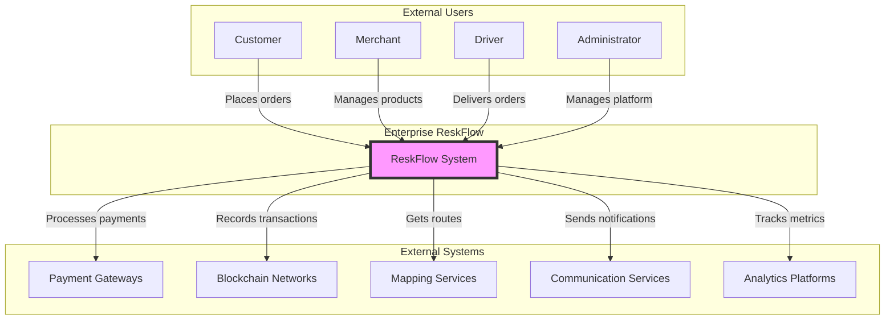

**Description**: This context diagram shows the Enterprise ReskFlow as the central system interacting with four types of users (Customer, Merchant, Driver, Admin) and five categories of external systems. It provides a high-level view of system boundaries and external interfaces.

### Microservices Architecture Overview

```mermaid
graph TB
    subgraph "Client Layer"
        Web[Web App]
        Mobile[Mobile Apps]
        Admin[Admin Portal]
    end
    
    subgraph "API Gateway Layer"
        Gateway[API Gateway<br/>Load Balancing, Auth, Rate Limiting]
    end
    
    subgraph "Service Layer"
        subgraph "Core Services"
            UserSvc[User Service]
            AuthSvc[Auth Service]
            OrderSvc[Order Service]
            PaymentSvc[Payment Service]
        end
        
        subgraph "Delivery Services"
            DeliverySvc[Delivery Service]
            TrackingSvc[Tracking Service]
            DriverSvc[Driver Service]
            RouteSvc[Route Service]
        end
        
        subgraph "Business Services"
            MerchantSvc[Merchant Service]
            CatalogSvc[Catalog Service]
            CartSvc[Cart Service]
            PromoSvc[Promotion Service]
        end
        
        subgraph "Support Services"
            NotificationSvc[Notification Service]
            AnalyticsSvc[Analytics Service]
            ChatSvc[Chat Service]
            SearchSvc[Search Service]
        end
    end
    
    subgraph "Data Layer"
        PG[(PostgreSQL)]
        Mongo[(MongoDB)]
        Redis[(Redis)]
        Elastic[(Elasticsearch)]
    end
    
    subgraph "Infrastructure"
        MQ[Message Queue]
        BC[Blockchain]
        Storage[Object Storage]
    end
    
    Web --> Gateway
    Mobile --> Gateway
    Admin --> Gateway
    
    Gateway --> UserSvc
    Gateway --> AuthSvc
    Gateway --> OrderSvc
    Gateway --> PaymentSvc
    Gateway --> DeliverySvc
    Gateway --> TrackingSvc
    Gateway --> DriverSvc
    Gateway --> RouteSvc
    Gateway --> MerchantSvc
    Gateway --> CatalogSvc
    Gateway --> CartSvc
    Gateway --> PromoSvc
    Gateway --> NotificationSvc
    Gateway --> AnalyticsSvc
    Gateway --> ChatSvc
    Gateway --> SearchSvc
    
    UserSvc --> PG
    OrderSvc --> PG
    PaymentSvc --> PG
    DeliverySvc --> Mongo
    TrackingSvc --> Redis
    SearchSvc --> Elastic
    
    NotificationSvc --> MQ
    PaymentSvc --> BC
    CatalogSvc --> Storage
```

**Description**: This diagram illustrates the microservices architecture with four main service categories: Core, Delivery, Business, and Support services. Each service is independently deployable and communicates through the API Gateway. The data layer shows different database technologies used for different purposes.

---

## Use Case Diagrams

### Customer Use Cases

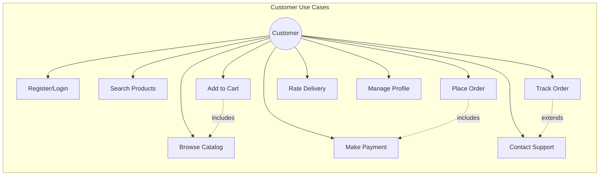

**Description**: Customer use cases cover the complete customer journey from registration to order completion. The diagram shows includes relationships (e.g., placing order includes making payment) and extends relationships (e.g., tracking order may extend to contacting support).

### Merchant Use Cases

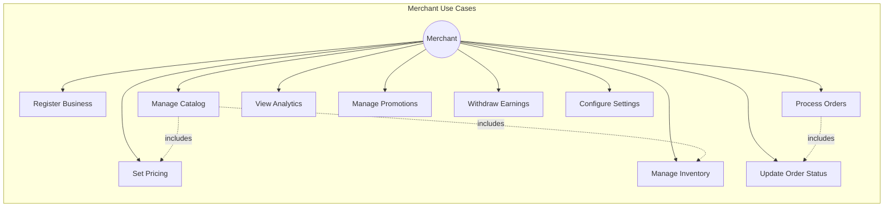

**Description**: Merchant use cases focus on business management capabilities including catalog management, order processing, and analytics. The relationships show that managing catalog includes setting pricing and managing inventory.

### Driver Use Cases

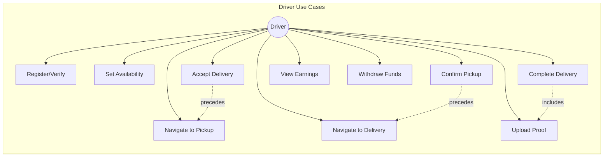

**Description**: Driver use cases cover the reskflow workflow from accepting assignments to completing deliveries. The diagram shows the sequential nature of reskflow operations and includes relationships like completing reskflow includes uploading proof.

---

## Class Diagrams

### Core Domain Model

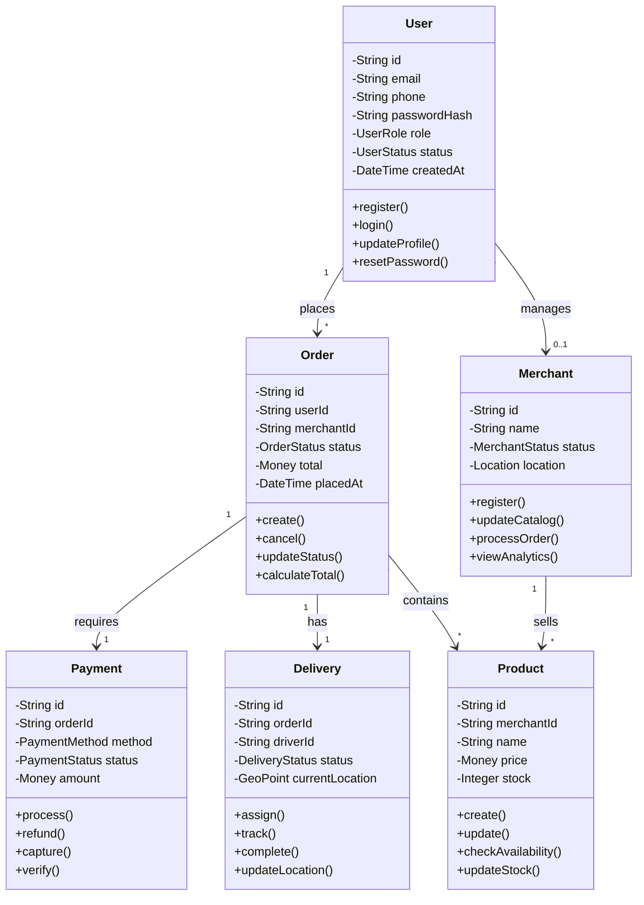

**Description**: This class diagram shows the core domain entities and their relationships. It includes the main business objects (User, Order, Payment, Delivery, Product, Merchant) with their key attributes and methods. The relationships show cardinality and ownership.

### Payment System Classes

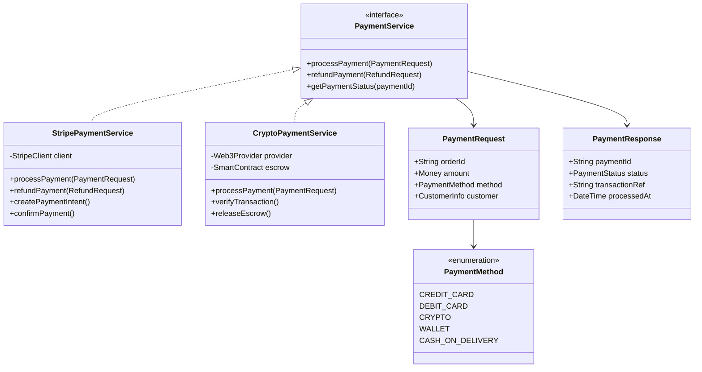

**Description**: This diagram illustrates the payment system design using the Strategy pattern. The PaymentService interface is implemented by different payment providers (Stripe, Crypto). This allows for easy addition of new payment methods without changing the core system.

### Delivery Tracking System

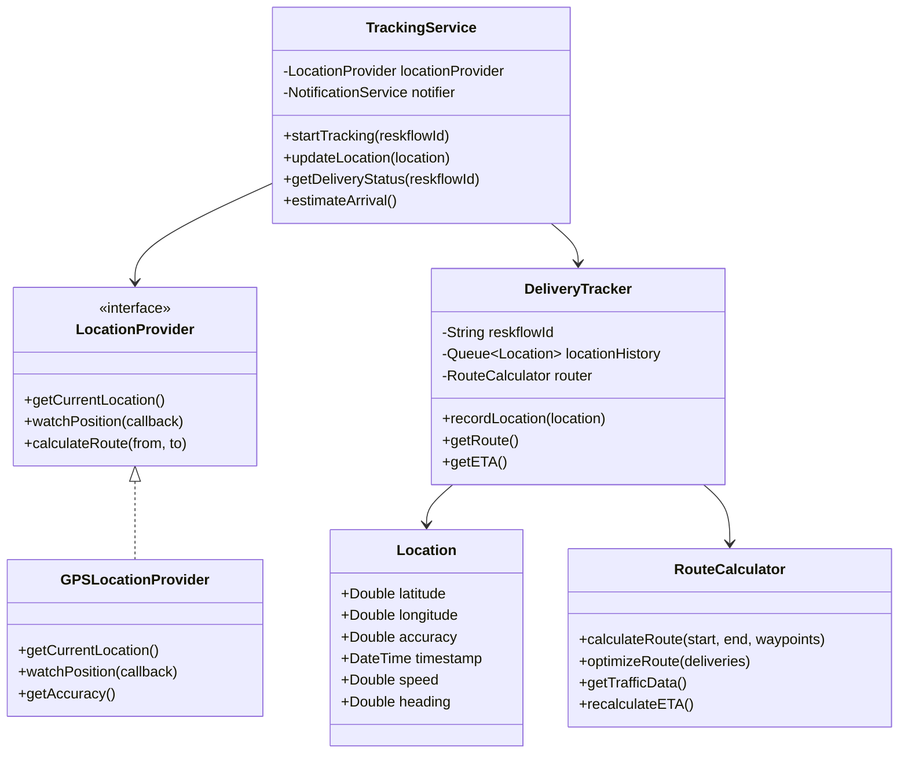

**Description**: The reskflow tracking system uses location providers to track deliveries in real-time. The system maintains location history, calculates routes, and provides ETA estimates. The design allows for different location providers (GPS, Network, etc.).

---

## Sequence Diagrams

### Order Placement Flow

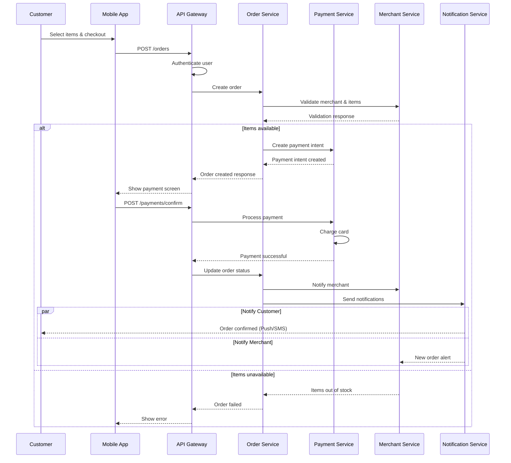

**Description**: This sequence diagram shows the complete order placement flow from customer selection to merchant notification. It includes payment processing, validation, and parallel notification sending. The alternative flow handles the case when items are unavailable.

### Delivery Assignment Flow

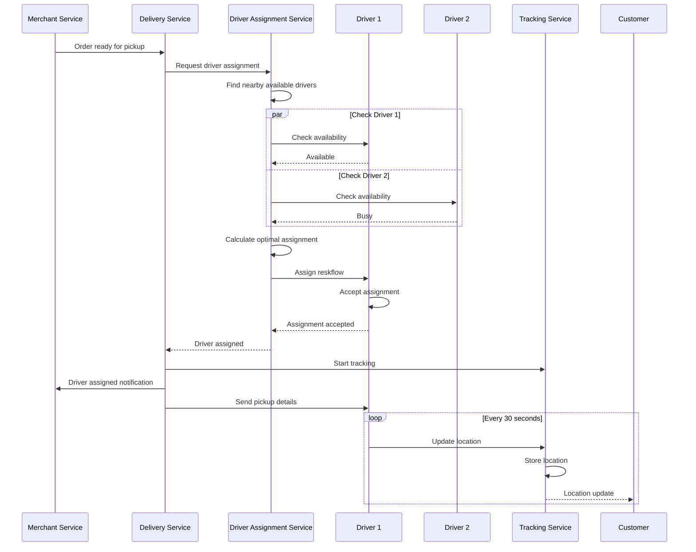

**Description**: This diagram illustrates the driver assignment process including availability checking, optimal assignment calculation, and real-time tracking initialization. It shows parallel operations and the continuous location update loop.

### Payment Processing with Blockchain

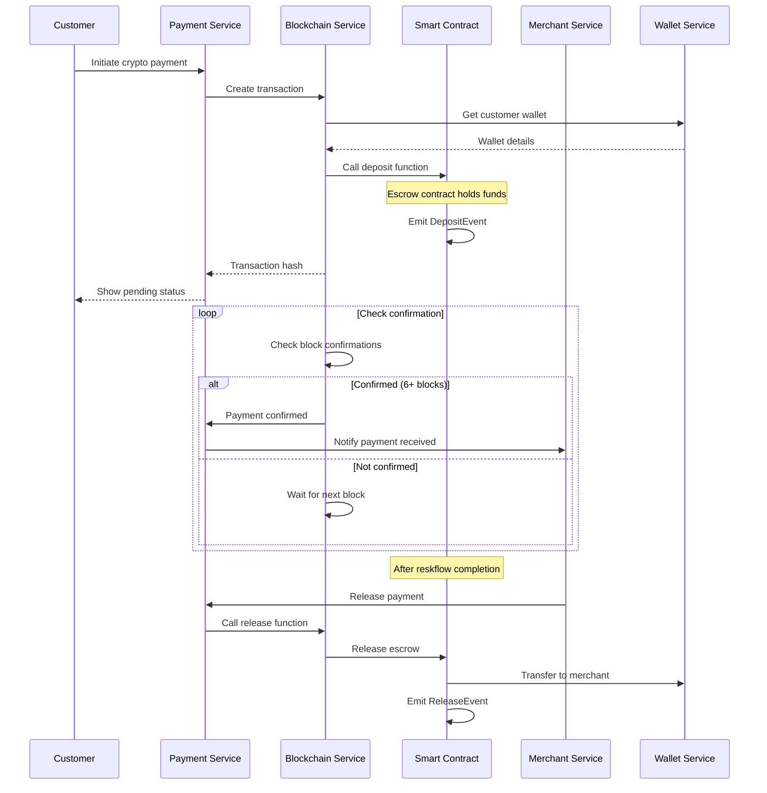

**Description**: This sequence shows cryptocurrency payment processing using smart contracts for escrow. It includes wallet interaction, blockchain confirmation waiting, and escrow release after reskflow completion.

---

## Activity Diagrams

### Customer Order Flow

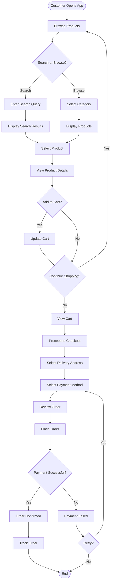

**Description**: This activity diagram shows the complete customer journey from browsing products to order tracking. It includes decision points for search vs browse, payment retry logic, and the checkout flow.

### Driver Delivery Flow

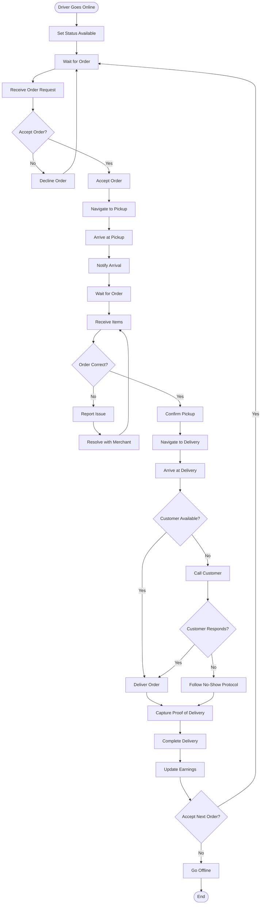

**Description**: This diagram illustrates the complete driver workflow from going online to completing deliveries. It includes decision points for order acceptance, issue resolution, and customer availability handling.

---

## State Machine Diagrams

### Order State Machine

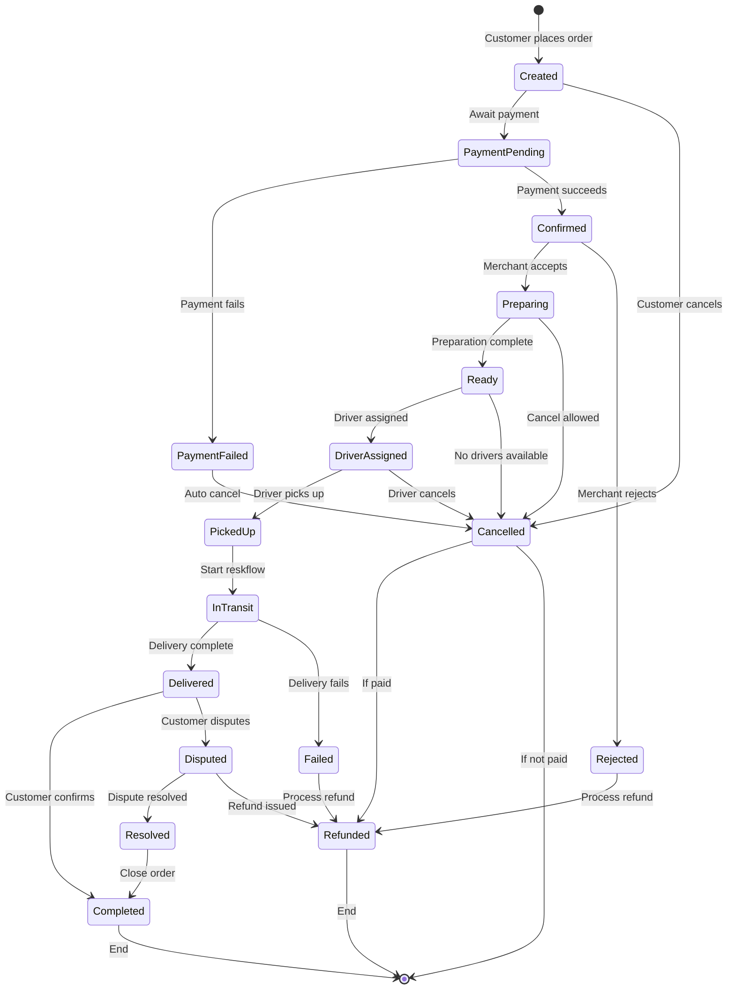

**Description**: This state machine diagram shows all possible states of an order from creation to completion. It includes payment states, cancellation paths, dispute handling, and refund processes. Each transition is triggered by specific events in the system.

### Delivery State Machine

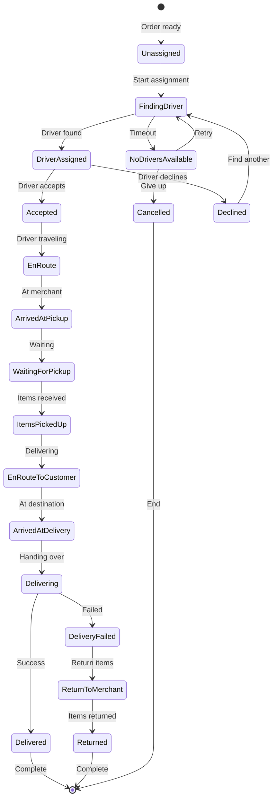

**Description**: This state machine represents the reskflow lifecycle from unassigned to completion. It handles driver assignment, pickup, reskflow, and failure scenarios with appropriate state transitions.

---

## Component Diagrams

### System Component Architecture

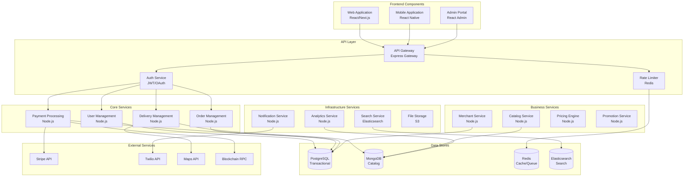

**Description**: This component diagram shows the system's modular architecture with clear separation of concerns. Components are grouped by functionality (Frontend, API, Services, Data, External) with defined interfaces and dependencies.

### Microservice Communication

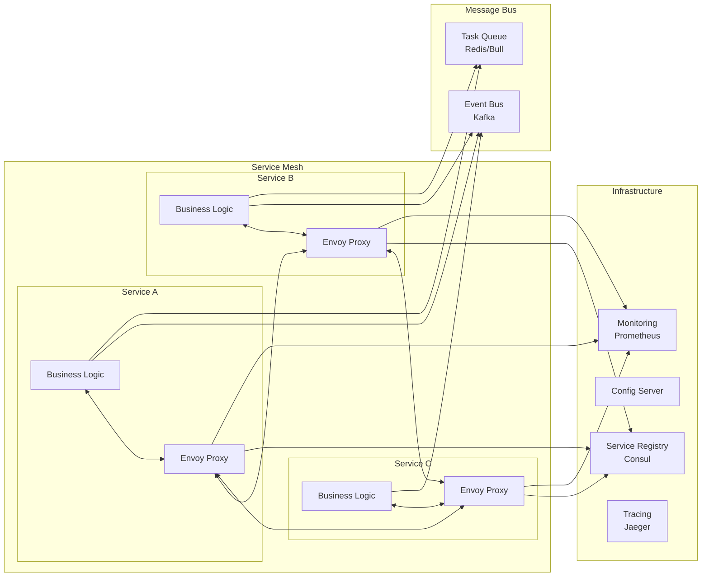

**Description**: This diagram illustrates the service mesh architecture with sidecar proxies (Envoy) handling cross-cutting concerns like service discovery, monitoring, and tracing. Services communicate through the mesh and use event bus for asynchronous communication.

---

## Deployment Diagrams

### Production Deployment Architecture

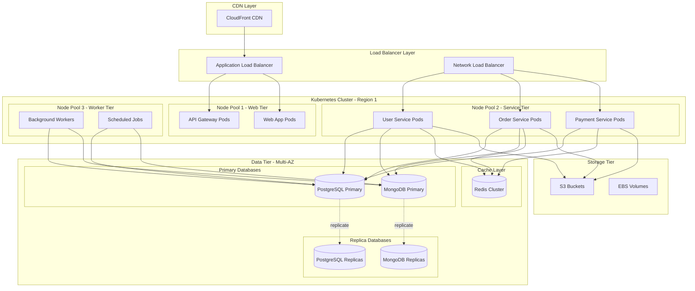

**Description**: This deployment diagram shows a production-ready architecture with CDN, load balancing, Kubernetes orchestration, and multi-AZ database deployment. It illustrates high availability through replication and separation of concerns through node pools.

### Container Deployment View

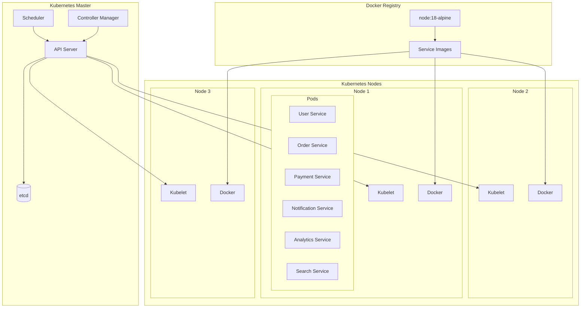

**Description**: This diagram shows the container deployment architecture using Kubernetes. It illustrates how container images are deployed to nodes, managed by Kubernetes components, and orchestrated across the cluster.

---

## Data Flow Diagrams

### Order Processing Data Flow

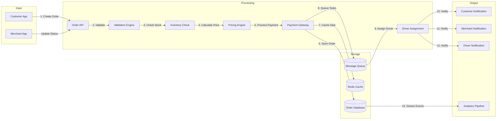

**Description**: This data flow diagram traces the path of order data through the system, from customer input through validation, payment, storage, and notification. Numbers indicate the sequence of operations.

### Real-time Tracking Data Flow

```mermaid
graph TB
    subgraph "Data Sources"
        Driver[Driver App]
        GPS[GPS Module]
        Network[Network Location]
    end
    
    subgraph "Ingestion Layer"
        LocationAPI[Location API]
        StreamProcessor[Stream Processor]
        Validator[Data Validator]
    end
    
    subgraph "Processing Layer"
        RouteEngine[Route Engine]
        ETACalculator[ETA Calculator]
        GeoFence[Geofence Monitor]
        Aggregator[Location Aggregator]
    end
    
    subgraph "Storage Layer"
        TimeSeriesDB[(Time Series DB)]
        LocationCache[(Location Cache)]
        RouteCache[(Route Cache)]
    end
    
    subgraph "Distribution Layer"
        WebSocket[WebSocket Server]
        PushNotification[Push Service]
        Analytics[Analytics Stream]
    end
    
    subgraph "Consumers"
        CustomerApp[Customer Apps]
        MerchantDash[Merchant Dashboard]
        AdminPanel[Admin Panel]
    end
    
    GPS --> Driver
    Network --> Driver
    Driver -->|Location Update| LocationAPI
    
    LocationAPI --> StreamProcessor
    StreamProcessor --> Validator
    
    Validator --> RouteEngine
    Validator --> ETACalculator
    Validator --> GeoFence
    Validator --> Aggregator
    
    RouteEngine --> RouteCache
    ETACalculator --> LocationCache
    Aggregator --> TimeSeriesDB
    
    LocationCache --> WebSocket
    RouteCache --> WebSocket
    
    WebSocket --> CustomerApp
    WebSocket --> MerchantDash
    
    GeoFence --> PushNotification
    PushNotification --> CustomerApp
    
    TimeSeriesDB --> Analytics
    Analytics --> AdminPanel
```

**Description**: This diagram shows how location data flows from drivers through the system to end consumers. It illustrates real-time processing, caching for performance, and multiple distribution channels for different user types.

---

## Appendices

### Diagram Legend

| Symbol | Meaning |
|--------|---------|
| Rectangle | Class/Component |
| Rounded Rectangle | State/Activity |
| Diamond | Decision Point |
| Circle | Start/End Point |
| Cylinder | Database |
| Solid Arrow | Direct Dependency |
| Dashed Arrow | Indirect Dependency |
| Dotted Line | Temporary Relationship |

### Color Coding

- **Blue**: User-facing components
- **Green**: Core business services
- **Yellow**: Infrastructure services
- **Red**: External dependencies
- **Gray**: Data stores

### Tool References

1. **PlantUML**: Text-based UML diagram tool
   - Website: https://plantuml.com
   - Usage: Generate diagrams from text descriptions

2. **Mermaid**: JavaScript based diagramming
   - Website: https://mermaid-js.github.io
   - Usage: Render diagrams in markdown

3. **Draw.io**: Visual diagram editor
   - Website: https://app.diagrams.net
   - Usage: Create and export diagrams

#
*For updates or corrections, please contact shahin@resket.ca*