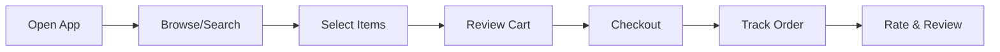

# User Documentation

## ReskFlow

### Version 1.0.0
### Last Updated: July 2025

---

## Table of Contents

1. [Customer User Guide](#customer-user-guide)
2. [Merchant User Guide](#merchant-user-guide)
3. [Driver User Guide](#driver-user-guide)
4. [Administrator Guide](#administrator-guide)
5. [Quick Start Guides](#quick-start-guides)
6. [Frequently Asked Questions (FAQs)](#frequently-asked-questions-faqs)
7. [Troubleshooting Guide](#troubleshooting-guide)
8. [API Developer Guide](#api-developer-guide)
9. [Release Notes](#release-notes)
10. [Support Information](#support-information)

---

## Customer User Guide

### Getting Started

Welcome to the ReskFlow! This guide will help you order products and track deliveries with ease.

#### Creating Your Account

1. **Download the App**
   - iOS: Search "ReskFlow" in App Store
   - Android: Search "ReskFlow" in Google Play Store
   - Web: Visit https://app.ReskFlow.com

2. **Sign Up**
   ```
   Required Information:
   - Email address or phone number
   - Password (min 8 characters)
   - Delivery address
   - Payment method
   ```

3. **Verify Your Account**
   - Check email for verification link
   - Or enter SMS code if using phone number
   - Complete profile setup

#### Placing Your First Order



##### Step-by-Step Order Process

1. **Find What You Want**
   - Browse categories (Food, Groceries, Pharmacy, etc.)
   - Use search bar for specific items
   - Filter by dietary preferences, price, ratings

2. **Add to Cart**
   - Tap item to view details
   - Select quantity and options
   - Add special instructions if needed
   - Click "Add to Cart"

3. **Review Your Order**
   - Access cart from bottom navigation
   - Modify quantities or remove items
   - Apply promo codes
   - Check estimated total

4. **Checkout**
   - Confirm reskflow address
   - Select reskflow time (ASAP or scheduled)
   - Choose payment method
   - Add tip for driver (optional)
   - Place order

5. **Track Your Delivery**
   - Real-time GPS tracking
   - Driver details and ETA
   - In-app chat with driver
   - Delivery notifications

### Features Guide

#### Group Orders

Perfect for office lunches or family dinners!

1. **Create Group Order**
   - Start order from restaurant
   - Tap "Make it a group order"
   - Share link with friends
   - Set deadline for orders

2. **Join Group Order**
   - Click shared link
   - Add your items
   - Pay for your portion
   - Track group order status

#### Subscription Service (Platform+)

Save on reskflow fees with our subscription!

**Benefits:**
- Free reskflow on orders over $15
- 10% off at select restaurants
- Priority support
- Exclusive promotions

**How to Subscribe:**
1. Go to Account → Platform+
2. Choose monthly or annual plan
3. Enter payment details
4. Start saving!

#### Scheduled Orders

Plan ahead for convenience:

1. During checkout, select "Schedule for later"
2. Choose date and time window
3. Receive reminder 1 hour before
4. Modify up to 30 minutes before scheduled time

### Account Management

#### Profile Settings

Access via Account tab:

- **Personal Information**: Update name, email, phone
- **Addresses**: Add/edit reskflow locations
- **Payment Methods**: Manage cards and wallets
- **Preferences**: Dietary restrictions, notifications
- **Order History**: View past orders, reorder favorites

#### Payment Options

Supported payment methods:
- Credit/Debit cards (Visa, Mastercard, Amex)
- Digital wallets (Apple Pay, Google Pay)
- Cryptocurrency (Bitcoin, Ethereum, USDC)
- Platform Credits
- Cash on reskflow (selected areas)

#### Safety Features

- **Contactless Delivery**: Request no-contact drop-off
- **Delivery Instructions**: Add gate codes, specific locations
- **Share Trip**: Send live tracking to friends/family
- **Emergency Support**: 24/7 help button

---

## Merchant User Guide

### Merchant Portal Overview

Welcome merchants! Manage your business efficiently with our comprehensive tools.

#### Getting Started

1. **Apply for Partnership**
   - Visit https://merchants.ReskFlow.com
   - Click "Become a Partner"
   - Submit business information
   - Upload required documents

2. **Account Activation**
   - Receive approval email (2-3 business days)
   - Set up your merchant profile
   - Configure payment settings
   - Add your menu/catalog

### Managing Your Business

#### Dashboard Overview

```
┌─────────────────────────────────────────────────┐
│                  Dashboard                       │
├─────────────┬────────────────┬─────────────────┤
│   Orders    │   Analytics    │   Settings      │
│   (Live)    │   (Today)      │                 │
├─────────────┼────────────────┼─────────────────┤
│ New: 5      │ Revenue: $2,450│ Menu Items: 45  │
│ Preparing: 3│ Orders: 87     │ Avg Rating: 4.7 │
│ Ready: 2    │ Avg Time: 28min│ Completion: 96% │
└─────────────┴────────────────┴─────────────────┘
```

#### Order Management

##### Receiving Orders

1. **New Order Notification**
   - Sound alert on tablet
   - Push notification
   - Order details display

2. **Accept/Reject Orders**
   - Review order details
   - Check preparation time
   - Accept within 2 minutes
   - Or reject with reason

3. **Order Preparation**
   - Mark as "Preparing"
   - Update preparation time if needed
   - Mark items as ready
   - Confirm "Ready for Pickup"

##### Order States

| State | Action Required | Time Limit |
|-------|----------------|------------|
| New | Accept/Reject | 2 minutes |
| Accepted | Start Preparing | - |
| Preparing | Mark Ready | Est. time |
| Ready | Wait for Driver | - |
| Picked Up | None | - |
| Delivered | None | - |

#### Menu Management

##### Adding Items

1. **Navigate to Menu → Add Item**
2. **Fill Required Information:**
   - Item name and description
   - Category (appetizers, mains, etc.)
   - Price
   - Preparation time
   - Photos (min 1, max 5)

3. **Set Availability:**
   - Always available
   - Specific hours
   - Limited quantity
   - Out of stock

##### Modifiers and Options

```yaml
Example Pizza Configuration:
  Base Item: Margherita Pizza
  
  Size Options (Required):
    - Small: $12
    - Medium: $16
    - Large: $20
  
  Crust Type (Required):
    - Regular: $0
    - Thin: $0
    - Stuffed: +$3
  
  Extra Toppings (Optional, Multiple):
    - Mushrooms: +$2
    - Pepperoni: +$3
    - Extra Cheese: +$2
```

#### Analytics and Reports

##### Daily Reports

View key metrics:
- Total revenue
- Number of orders
- Average order value
- Popular items
- Customer ratings

##### Performance Insights

```
Weekly Performance:
┌─────────────────────────────┐
│ Mon: ████████ $1,250 (45)   │
│ Tue: ██████ $980 (38)       │
│ Wed: ███████ $1,100 (42)    │
│ Thu: ████████ $1,300 (48)   │
│ Fri: ██████████ $1,850 (67) │
│ Sat: ███████████ $2,100 (78)│
│ Sun: █████████ $1,680 (62)  │
└─────────────────────────────┘
```

#### Promotions and Marketing

##### Creating Promotions

1. **Types of Promotions:**
   - Percentage discount (10-50% off)
   - Fixed amount discount ($5 off)
   - BOGO (Buy One Get One)
   - Free reskflow
   - Combo deals

2. **Setting Parameters:**
   - Start and end date
   - Minimum order amount
   - Specific items or categories
   - Customer segments
   - Usage limits

##### Featured Placement

Boost visibility:
- Featured in category
- Homepage banner
- Search priority
- Push notification campaigns

### Best Practices

#### Optimizing for Success

1. **High-Quality Photos**
   - Well-lit, appetizing images
   - Show actual portions
   - Multiple angles
   - Update seasonally

2. **Accurate Descriptions**
   - List all ingredients
   - Highlight special features
   - Mention allergens
   - Specify portion sizes

3. **Competitive Pricing**
   - Research competitor prices
   - Consider platform fees
   - Offer value combos
   - Regular promotions

4. **Fast Response Times**
   - Accept orders quickly
   - Accurate prep times
   - Communicate delays
   - Maintain quality

---

## Driver User Guide

### Becoming a Driver

#### Requirements

- Valid driver's license
- Vehicle (car, bike, scooter)
- Smartphone (iOS 12+ or Android 8+)
- Background check clearance
- Minimum age: 18 years

#### Application Process

1. **Apply Online**
   - Visit https://drivers.ReskFlow.com
   - Complete application form
   - Upload documents
   - Schedule orientation

2. **Document Checklist**
   - Driver's license (front & back)
   - Vehicle registration
   - Insurance proof
   - Profile photo
   - Bank account details

3. **Orientation**
   - Platform overview (1 hour)
   - App training
   - Safety guidelines
   - First reskflow walkthrough

### Using the Driver App

#### Going Online

1. **Start Your Shift**
   - Open driver app
   - Tap "Go Online"
   - Select vehicle type
   - Enable location services

2. **Setting Preferences**
   - Delivery zones
   - Order types (food, packages)
   - Maximum distance
   - Scheduled hours

#### Accepting Deliveries

##### Order Request Screen

```
┌─────────────────────────────┐
│   New Delivery Request      │
│                             │
│ Restaurant: Pizza Palace    │
│ Distance: 3.2 miles         │
│ Estimated time: 25 mins     │
│ Earnings: $8.50             │
│                             │
│ Items: 2                    │
│ Customer: 1.5 miles away    │
│                             │
│ [Decline]     [Accept: 45s] │
└─────────────────────────────┘
```

##### Decision Factors

Consider before accepting:
- Total distance and time
- Earnings vs effort
- Current traffic conditions
- Pickup location familiarity
- Drop-off area safety

#### Delivery Process

##### Step 1: Navigate to Pickup

- Tap "Navigate" for directions
- Check merchant notes
- Find parking safely
- Bring reskflow bag

##### Step 2: At the Merchant

1. **Arrival**
   - Tap "Arrived at store"
   - Go to pickup area
   - Provide order number
   - Verify items

2. **Waiting**
   - If order not ready, tap "Order not ready"
   - Wait in designated area
   - Keep app updated

3. **Pickup**
   - Verify all items present
   - Check drinks secured
   - Get utensils/napkins
   - Tap "Picked up order"

##### Step 3: Delivery

1. **Navigation**
   - Follow GPS to customer
   - Check reskflow notes
   - Look for apartment/gate codes
   - Find safe parking

2. **At Delivery Location**
   - Tap "Arrived"
   - Follow reskflow preference:
     - Hand to customer
     - Leave at door
     - Meet in lobby

3. **Completion**
   - Take photo if contactless
   - Tap "Delivered"
   - Rate experience (optional)

#### Earnings and Payments

##### Payment Structure

```
Base Pay: $3.00
+ Distance: $1.50 (3 miles × $0.50/mile)
+ Time: $2.00 (20 mins × $0.10/min)
+ Tip: $3.00
+ Surge: $1.50 (1.5x multiplier)
─────────────────
Total: $11.00
```

##### Weekly Payouts

- **Direct Deposit**: Every Tuesday
- **Instant Pay**: Available daily ($0.50 fee)
- **Earnings Statement**: In-app history
- **Tax Documents**: Annual 1099

#### Safety Guidelines

##### Personal Safety

1. **Trust Your Instincts**
   - Decline unsafe deliveries
   - Leave if uncomfortable
   - Report incidents immediately

2. **Vehicle Safety**
   - Regular maintenance
   - Proper insurance
   - Defensive driving
   - Secure items properly

3. **COVID-19 Precautions**
   - Contactless reskflow default
   - Wear mask if requested
   - Sanitize regularly
   - Maintain distance

##### In-App Safety Features

- **Emergency Button**: Direct 911 access
- **Share Trip**: Send location to contact
- **Support Chat**: 24/7 assistance
- **Incident Reporting**: Document issues

---

## Administrator Guide

### Admin Portal Overview

The admin portal provides comprehensive platform management capabilities.

#### Access Levels

| Role | Permissions | Access Areas |
|------|------------|--------------|
| Super Admin | All permissions | Everything |
| Operations Manager | Operational tasks | Orders, support, merchants |
| Support Lead | Customer service | Tickets, users, orders |
| Finance Admin | Financial data | Payments, payouts, reports |
| Marketing Admin | Promotional tools | Campaigns, analytics |

### System Management

#### User Management

##### Managing Customer Accounts

1. **Search Users**
   - By email, phone, or ID
   - Filter by status, date joined
   - View order history
   - Check payment methods

2. **Account Actions**
   - Reset password
   - Verify email/phone
   - Suspend/reactivate
   - Merge duplicate accounts

3. **Support Tools**
   - View current cart
   - Cancel active orders
   - Issue refunds
   - Add platform credits

##### Managing Merchants

1. **Onboarding**
   - Review applications
   - Verify documents
   - Approve/reject
   - Set commission rates

2. **Performance Monitoring**
   - Order completion rate
   - Average prep time
   - Customer ratings
   - Revenue metrics

3. **Actions**
   - Temporarily disable
   - Adjust commission
   - Feature merchant
   - Send warnings

##### Managing Drivers

1. **Driver Overview**
   - Active drivers map
   - Performance metrics
   - Earnings summary
   - Vehicle information

2. **Driver Actions**
   - Approve applications
   - Update documents
   - Adjust zones
   - Resolve disputes

#### Order Management

##### Order Monitoring Dashboard

```
┌─────────────────────────────────────────┐
│          Live Orders Monitor            │
├─────────────┬─────────────┬────────────┤
│   Pending   │ In Progress │ Delivered  │
│     247     │     1,832   │   8,421    │
├─────────────┴─────────────┴────────────┤
│ Issues: 12  │ Delays: 34  │ Success: 98.2% │
└─────────────────────────────────────────┘
```

##### Order Interventions

1. **Common Issues**
   - Driver not assigned
   - Merchant delays
   - Customer unreachable
   - Payment failures

2. **Resolution Actions**
   - Reassign driver
   - Contact merchant
   - Process refund
   - Apply credits

#### Financial Management

##### Payment Processing

1. **Transaction Monitoring**
   - Real-time payment flow
   - Failed transaction alerts
   - Fraud detection flags
   - Chargeback management

2. **Reconciliation**
   - Daily settlement reports
   - Merchant payouts
   - Driver earnings
   - Platform fees

##### Revenue Analytics

```
Monthly Revenue Breakdown:
┌─────────────────────────────┐
│ Delivery Fees:    $487,250  │
│ Service Fees:     $892,100  │
│ Subscription:     $156,000  │
│ Advertising:      $67,500   │
│ ─────────────────────────── │
│ Total:          $1,602,850  │
└─────────────────────────────┘
```

#### Platform Configuration

##### Service Settings

1. **Operational Parameters**
   - Service areas/zones
   - Operating hours
   - Delivery radius
   - Order limits

2. **Pricing Configuration**
   - Base reskflow fee
   - Service fee percentage
   - Surge pricing rules
   - Minimum order values

3. **Feature Toggles**
   - Enable/disable features
   - A/B testing groups
   - Regional variations
   - Beta features

##### Integration Management

Manage third-party services:
- Payment gateways
- SMS providers
- Email services
- Mapping APIs
- Analytics tools

---

## Quick Start Guides

### Customer Quick Start

```markdown
## Start Ordering in 5 Minutes!

1. **Download & Sign Up**
   📱 Get the app → Create account → Verify email

2. **Add Payment & Address**
   💳 Add card → 📍 Set reskflow location

3. **Find Food**
   🔍 Search or browse → Filter by preference

4. **Order**
   🛒 Add to cart → Checkout → Track reskflow

5. **Enjoy!**
   🎉 Receive order → Rate experience
```

### Merchant Quick Start

```markdown
## Start Selling in 24 Hours!

1. **Apply Online**
   💻 Submit application → Upload documents

2. **Get Approved**
   ✅ Receive approval → Access merchant portal

3. **Setup Store**
   🏪 Add business info → Upload menu → Set hours

4. **Go Live**
   🚀 Receive first order → Start earning!

5. **Grow**
   📈 Check analytics → Run promotions → Expand
```

### Driver Quick Start

```markdown
## Start Earning Today!

1. **Apply**
   📝 Online application → Upload documents

2. **Get Activated**
   ✅ Pass background check → Complete orientation

3. **Go Online**
   🚗 Open app → Set availability → Accept orders

4. **Deliver**
   📦 Pick up → Navigate → Drop off

5. **Earn**
   💰 See earnings → Get paid weekly
```

---

## Frequently Asked Questions (FAQs)

### Customer FAQs

#### Ordering

**Q: What's the minimum order amount?**
A: Minimum orders vary by merchant, typically $10-15. You'll see the minimum on the merchant's page.

**Q: Can I schedule orders in advance?**
A: Yes! Schedule up to 7 days in advance. Select "Schedule for later" during checkout.

**Q: How do I use a promo code?**
A: Enter the code in the "Promo Code" field at checkout. Only one code per order.

**Q: Can I modify my order after placing it?**
A: You can cancel within 60 seconds. After that, contact support for assistance.

#### Delivery

**Q: How do I track my order?**
A: Tap your active order in the app to see real-time tracking and driver details.

**Q: What if my order is late?**
A: We'll notify you of delays. If significantly late, you may receive credits.

**Q: Can I change my reskflow address?**
A: Only within 60 seconds of ordering. Contact support for emergencies.

**Q: What's contactless reskflow?**
A: Driver leaves order at your door, takes a photo, and notifies you.

#### Payment

**Q: What payment methods are accepted?**
A: Credit/debit cards, Apple Pay, Google Pay, cryptocurrency, and cash (select areas).

**Q: When am I charged?**
A: Card is authorized at order placement, charged when driver picks up.

**Q: How do refunds work?**
A: Refunds process within 5-7 business days to your original payment method.

**Q: Is tipping required?**
A: Tips are optional but appreciated. 100% goes to the driver.

### Merchant FAQs

#### Getting Started

**Q: How long does approval take?**
A: Typically 2-3 business days after document submission.

**Q: What are the fees?**
A: Commission ranges from 15-30% based on service type and volume.

**Q: Do I need special equipment?**
A: Just a tablet or smartphone to receive orders. We provide the app.

**Q: Can I use my own reskflow drivers?**
A: Yes, you can use our drivers, your own, or both.

#### Operations

**Q: How do I update my menu?**
A: Log into merchant portal → Menu → Edit items. Changes reflect immediately.

**Q: What if I run out of an item?**
A: Mark it "Out of Stock" in the app. It'll be hidden from customers.

**Q: Can I set different prices for reskflow?**
A: Yes, you can set reskflow-specific pricing in your menu settings.

**Q: How do I handle special requests?**
A: Special instructions appear with each order. Contact customer if unclear.

#### Payments

**Q: When do I get paid?**
A: Weekly payouts every Tuesday for previous week's orders.

**Q: How are fees calculated?**
A: Commission on subtotal + payment processing (2.9% + $0.30).

**Q: Can I see fee breakdowns?**
A: Yes, detailed reports available in the Financial section.

**Q: What about chargebacks?**
A: We handle initial dispute. May need your input for resolution.

### Driver FAQs

#### Getting Started

**Q: What vehicles are accepted?**
A: Cars, motorcycles, scooters, and bicycles (in select areas).

**Q: How long is the approval process?**
A: Usually 3-5 days for background check completion.

**Q: Can I drive for other platforms?**
A: Yes, you're an independent contractor.

**Q: What are the insurance requirements?**
A: Valid auto insurance meeting state minimums. Additional coverage recommended.

#### Deliveries

**Q: Can I see reskflow details before accepting?**
A: Yes, you'll see distance, estimated time, and guaranteed earnings.

**Q: What if the restaurant is closed?**
A: Mark as "Store Closed" - you'll receive partial compensation.

**Q: What if I can't find the customer?**
A: Use in-app chat/call. After 5 minutes, follow app prompts.

**Q: Can I decline orders?**
A: Yes, but high acceptance rates get priority for orders.

#### Earnings

**Q: How is pay calculated?**
A: Base pay + mileage + time + tips + any surge pricing.

**Q: When can I cash out?**
A: Weekly automatic or daily instant pay ($0.50 fee).

**Q: Are tips guaranteed?**
A: Pre-tips are guaranteed. Customers can add more after reskflow.

**Q: What about gas and expenses?**
A: You're responsible as an independent contractor. Track for taxes.

---

## Troubleshooting Guide

### Common Issues and Solutions

#### App Issues

##### App Won't Open
```
1. Force close the app
2. Restart your device  
3. Check for app updates
4. Reinstall if needed
5. Contact support if persists
```

##### Can't Log In
```
1. Check email/password spelling
2. Try "Forgot Password"
3. Verify account is active
4. Clear app cache
5. Try different network
```

##### GPS Not Working
```
iOS:
Settings → Privacy → Location → Delivery App → Always Allow

Android:
Settings → Apps → Delivery App → Permissions → Location → Allow
```

#### Order Issues

##### Order Stuck on "Confirming"
- Wait 2-3 minutes for merchant response
- Check your internet connection
- If over 5 minutes, contact support

##### Wrong Items Received
1. Take photos of incorrect items
2. Report through app → Order → Report Issue
3. Select "Wrong items"
4. Submit photos
5. Receive credits/refund

##### Missing Items
1. Check all bags/containers
2. Contact driver first (if just delivered)
3. Report in app within 24 hours
4. Provide specific missing items
5. Resolution within 48 hours

#### Payment Issues

##### Payment Declined
Common reasons:
- Insufficient funds
- Incorrect CVV
- Expired card
- Bank fraud prevention

Solutions:
- Verify card details
- Contact your bank
- Try different payment method
- Use PayPal/Apple Pay

##### Overcharged
1. Check itemized receipt
2. Verify promotions applied
3. Check for surge pricing notice
4. Contact support with screenshots

#### Delivery Issues

##### Can't Contact Driver
- Use in-app chat first
- Call button if no response
- Contact support if unreachable
- Track order on map

##### Order Never Arrived
1. Check reskflow address accuracy
2. Look for contactless photo
3. Check with neighbors/lobby
4. Report immediately in app
5. Full refund if confirmed

---

## API Developer Guide

### Getting Started with APIs

#### API Access

1. **Request API Access**
   - Visit https://developers.ReskFlow.com
   - Create developer account
   - Submit use case
   - Receive API credentials

2. **Authentication**
   ```bash
   curl -X POST https://api.ReskFlow.com/v1/auth/token \
     -H "Content-Type: application/json" \
     -d '{
       "client_id": "your_client_id",
       "client_secret": "your_client_secret"
     }'
   ```

3. **Making Requests**
   ```bash
   curl -X GET https://api.ReskFlow.com/v1/merchants \
     -H "Authorization: Bearer your_access_token" \
     -H "Accept: application/json"
   ```

#### Available Endpoints

##### Merchant APIs
- `GET /v1/merchants` - List merchants
- `GET /v1/merchants/{id}` - Merchant details
- `GET /v1/merchants/{id}/menu` - Menu items
- `POST /v1/merchants/{id}/orders` - Create order

##### Order APIs
- `POST /v1/orders` - Create order
- `GET /v1/orders/{id}` - Order details
- `PUT /v1/orders/{id}` - Update order
- `GET /v1/orders/{id}/track` - Track order

##### User APIs
- `GET /v1/users/profile` - User profile
- `PUT /v1/users/profile` - Update profile
- `GET /v1/users/orders` - Order history
- `POST /v1/users/addresses` - Add address

#### Webhooks

Configure webhooks for real-time updates:

```json
{
  "url": "https://your-server.com/webhooks",
  "events": [
    "order.created",
    "order.updated", 
    "order.delivered",
    "payment.completed"
  ]
}
```

#### Rate Limits

| Endpoint Type | Limit | Window |
|---------------|-------|--------|
| Search | 100 | 1 minute |
| Orders | 500 | 1 minute |
| General | 1000 | 1 hour |

#### SDKs

Official SDKs available:
- JavaScript/Node.js
- Python
- PHP
- Ruby
- Java

Example (JavaScript):
```javascript
const DeliveryClient = require('@ReskFlow/sdk');

const client = new DeliveryClient({
  apiKey: 'your_api_key',
  environment: 'production'
});

// Search merchants
const merchants = await client.merchants.search({
  query: 'pizza',
  location: {
    lat: 40.7128,
    lng: -74.0060
  }
});

// Create order
const order = await client.orders.create({
  merchantId: 'merchant_123',
  items: [{
    id: 'item_456',
    quantity: 2
  }],
  reskflowAddress: '123 Main St'
});
```

---

## Release Notes

### Version 1.0.0 (July 2025)

#### 🎉 Platform Launch

We're excited to announce the official launch of the ReskFlow!

#### ✨ Key Features

##### For Customers
- Multi-category ordering (food, groceries, pharmacy)
- Real-time order tracking
- Group ordering capability
- Subscription service (Platform+)
- Cryptocurrency payments
- Contactless reskflow

##### For Merchants  
- Comprehensive dashboard
- Menu management system
- Analytics and insights
- Promotional tools
- Multi-location support

##### For Drivers
- Optimized routing
- Earnings transparency  
- Flexible scheduling
- In-app navigation
- Instant pay option

##### Platform Capabilities
- Blockchain integration for transparency
- AI-powered recommendations
- Advanced search with filters
- Multi-language support (10 languages)
- 24/7 customer support

#### 🔧 Technical Specifications
- Response time: <200ms average
- Uptime: 99.99% SLA
- Supported platforms: iOS 14+, Android 10+, Web
- API version: 1.0
- Security: SOC 2 Type II compliant

#### 📱 Mobile App Features
- Biometric authentication
- Push notifications
- Offline mode (browse only)
- Dark mode support
- Accessibility features

#### 🌍 Launch Markets
- United States (all states)
- Canada (major cities)
- More markets coming soon!

#### 🐛 Known Issues
- Minor UI glitches on iPad landscape mode
- Occasional delay in push notifications
- Search filters may need page refresh

#### 🔮 Coming Soon
- Voice ordering
- AR menu visualization  
- Drone reskflow pilot
- Loyalty rewards program
- Business catering

### Previous Releases

#### Version 0.9.0 (Beta)
- Beta testing with 10,000 users
- Core features implementation
- Bug fixes and optimizations

#### Version 0.8.0 (Alpha)
- Internal testing
- Basic functionality
- Infrastructure setup

---

## Support Information

### Getting Help

#### Customer Support

**Available 24/7**

- **In-App Chat**: Fastest response
- **Email**: shahin@resket.ca
- **Phone**: 1-800-DELIVER (1-800-335-4837)
- **Help Center**: https://help.ReskFlow.com

**Response Times**
- Chat: < 2 minutes
- Email: < 4 hours
- Phone: < 30 seconds

#### Merchant Support

**Hours**: Monday-Sunday, 6 AM - 11 PM EST

- **Merchant Hotline**: 1-800-MERCHANT
- **Email**: shahin@resket.ca
- **Portal**: Merchant dashboard → Support

**Dedicated Support For**:
- Technical issues
- Payment questions
- Menu assistance
- Marketing guidance

#### Driver Support

**Available during reskflow hours**

- **Driver Hotline**: 1-800-DRIVERS
- **In-App Support**: Profile → Help
- **Email**: shahin@resket.ca

**Emergency Support**: 24/7 for safety issues

### Feedback and Suggestions

We value your input!

- **Feature Requests**: shahin@resket.ca
- **Bug Reports**: shahin@resket.ca
- **General Feedback**: In-app feedback form

### Legal Information

- **Terms of Service**: https://ReskFlow.com/terms
- **Privacy Policy**: https://ReskFlow.com/privacy
- **Cookie Policy**: https://ReskFlow.com/cookies

### Business Inquiries

- **Partnerships**: shahin@resket.ca
- **Investor Relations**: shahin@resket.ca
- **Media Inquiries**: shahin@resket.ca
- **Corporate Orders**: shahin@resket.ca

### Office Locations

**Headquarters**
```
ReskFlow, Inc.
123 Innovation Drive
San Francisco, CA 94105
United States
```

**Regional Offices**
- New York
- Toronto  
- London (Coming 2026)
- Singapore (Coming 2026)

### Social Media

Stay connected!

- Twitter: @reskflowplatform
- Facebook: /reskflowplatform
- Instagram: @reskflowplatform
- LinkedIn: /company/ReskFlow
- YouTube: /reskflowplatform

### Developer Resources

- **API Documentation**: https://developers.ReskFlow.com
- **GitHub**: https://github.com/ReskFlow
- **Stack Overflow**: Tag [ReskFlow]
- **Developer Forum**: https://forum.ReskFlow.com

---

*Thank you for choosing ReskFlow! We're committed to providing the best reskflow experience powered by blockchain technology.*

*Last updated: July 2025 | Version 1.0.0*